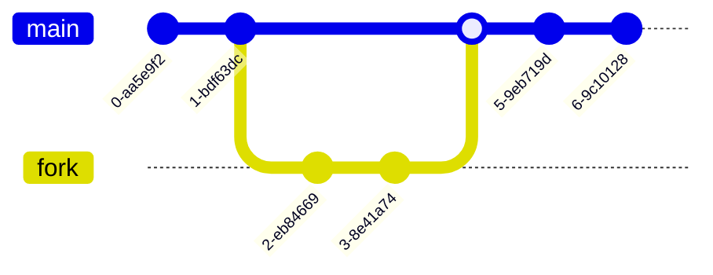

# Utiliser une base de connaissance

Utiliser Dojo-101 afin d'identifier les gestes professionnels à réaliser

Poids: 1

> [!NOTE] 
> Ce contenu est publié sous licence "GNU GENERAL PUBLIC LICENSE Version 3" et les sources sont sur le projet Github Dojo-101, merci d'en tenir compte dans vos usages.

## Ressources

* [Gestes professionnels](https://github.com/Aif4thah/Dojo-101)
* [github-desktop](https://desktop.github.com/)
* [VSCode](https://code.visualstudio.com/)
* [Markdown Wikipedia](https://fr.wikipedia.org/wiki/Markdown)
* [Mermaid](https://mermaid.live/)

## Contexte

Durant votre formation, j'utilise Dojo-101 comme base de connaissance. Vous y trouverez tout le nécessaire et bien plus.

Il est nécessaire que vous vous appropriiez le `markdown` (langage texte très simple qui se convertit facilement en HTML) et quelques commandes `git`

## Modalités pédagogiques

### Partie 1: découverte de github

0. Parcourir le projet via votre navigateur Web et lire le "README" 
1. Trouver le fichier "PowerShell-Basics.md" grâce à la barre de recherche.
2. Cloner le projet dans un dossier local à l'aide la commande *git clone* ou *GitHub Desktop*
3. à l'aide de *VSCode*, recherchez tous les fichiers contenant le mot clé *GPO* 
4. Quel fichier donne la commande permettant d'*éditer la politique de sécurité locale* ?
5. presser *ctrl+shift+v* pour visualiser le fichier au *format html*
6. Mettre à jour votre dossier local en faisant un git pull

### Partie 2: contribuer à un projet Open Source

7. Qu'est-ce qu'un *fork* (dans le contexte git/github) ?
8. Forker le projet, cloner votre fork et copier le fichier README.md, appellez-le "README-from-Fork.md"
9. Dans ce fichier, décrivez au format markdown les étapes à réaliser pour créer une pull request à partir d'un fork.
10. Pousser les changements sur votre fork
11. Créer une pull request sur Aif4thah/Dojo-101 afin de me demander d'ajouter le fichier "README-from-Fork.md" sur mon dépôt (pour cela vous devez au préalable Forker, cloner, commit changes et push vers votre fork).

## Modalités d'évaluation

Relecture des réponses aux questions

## Livrables

* Pull request
* Réponses aux questions + n° de la pull request

## Critères de performance

Réussir à se documenter et à trouver les informations recherchées
Réussir à creer une pull request

## Pour finir

Si vous avez apprécié ce cours et souhaitez valoriser votre travail, n'hésitez pas à ajouter une ⭐ au [projet](https://github.com/Aif4thah/Dojo-101)