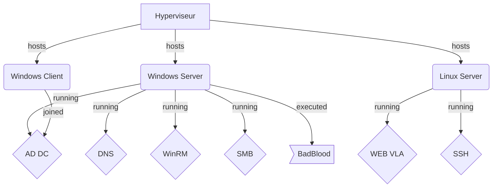

# Mettre en place un environnement de test (Lab)

Ce lab vous servira pour les mises en situations professionnelles

Durée estimée: 2 jours

Ce contenu est publié sous licence "GNU GENERAL PUBLIC LICENSE Version 3" et les sources sont sur le projet Github Dojo-101, merci d'en tenir compte dans vos usages.

## Ressources

* [Gestes professionnels](https://github.com/Aif4thah/Dojo-101)
* [VulnerableLightApp](https://github.com/Aif4thah/VulnerableLightApp)
* [Badblood](https://github.com/davidprowe/BadBlood)
* [ISO Microsoft](https://www.microsoft.com/fr-fr/evalcenter)
* [ISO Linux Debian](https://www.debian.org/index.fr.html)
* [WinRM](https://learn.microsoft.com/fr-fr/windows/win32/winrm/installation-and-configuration-for-windows-remote-management)

## Contexte

0. Télécharger les images (ISO ou VM) Windows et Linux et vérifier leurs intégrités (Hashs ou Signatures) 
1. Installer 3 machines virtuelles (VM) : Un contrôleur de domaine (Windows Serveur) + 1 Windows (client) + 1 Linux
2. Faire les mises à jour de sécurité
3. Pour la Workstation Windows: Joindre le domaine (attention à la licence)
4. Créer un utilisateur admin (root/administrateur) + un utilisateur standard (non-admin) et local sur chaque machine
5. Mettre en place les services sur l’AD et configurer la Workstation pour leur utilisation
    * DNS (Windows) : celui présent par défaut Domaine AD
    * WinRM (Windows) : accessible uniquement aux administrateurs de l'AD. 
    * SMB (Windows) : 1 partage "Readonly" + 1 partage accessible en écriture, sans authentification. 
    * Web (Linux) : VulnerableLightApp doit être lancé et accessible via le réseau - le binaire contient déja un serveur Web (Kestrel)
    * SSH (Linux) : accessible aux membres du groupe sudoers
6. exécution du script badblood: `. ./invoke-badblood.ps1`

## Modalités pédagogiques

Binôme ou seul (au choix)

> Attention les éléments mis en place contiennent des vulnérabilités (indispensables pour l'apprentissage), il faudra par précaution:

 * Mettre à jour l'hyperviseur
 * Isoler au maximum le serveur Windows une fois que le nécessaire est installé
 * Limiter l'exposition des VM à l'hôte ou au réseau local, les éteindre lorsqu'on ne s'en sert pas.
 * Supprimer immédiatement les VM en cas de doute sur leur intégrité

## Modalités d'évaluation

vérification des captures d'écran

## Livrables

* Captures d'écran

    * Vérification des intégrités des images téléchargées avant l'installation
    * le statut des services DNS et Web
    * connexions SSH et WinRM réussies (Connexion + commande `whoami`)
    * Permissions et statut du partage SMB ou Samba
    * le nombre d'utilisateurs contenus dans l'AD

## Critères de performance

Le Lab est opérationnel

## Pour finir

Si vous avez apprécié ce cours et souhaitez valoriser votre travail, n'hésitez pas à ajouter une ⭐ au [projet](https://github.com/Aif4thah/Dojo-101)