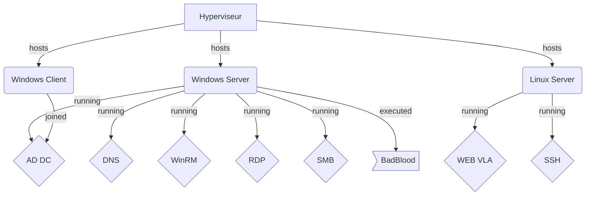

# Mettre en place un environnement de test (Lab)

L'objectif de ce Lab est de créer un environnement à la fois vulnérable et réaliste par rapport aux services disponibles en entreprise.
Nous avons un environnement Windows AD (client et serveur) pour l'administration bureautique et un serveur Linux hébergeant une application métier.

Poids: 4

> [!NOTE]
> Ce contenu est publié sous licence "GNU GENERAL PUBLIC LICENSE Version 3" et les sources sont sur le projet Github Dojo-101, merci d'en tenir compte dans vos usages.

## Ressources

* [Gestes professionnels](https://github.com/Aif4thah/Dojo-101)
* [VulnerableLightApp](https://github.com/Aif4thah/VulnerableLightApp)
* [Badblood](https://github.com/davidprowe/BadBlood)
* [ISO Microsoft](https://www.microsoft.com/fr-fr/evalcenter)
* [ISO Linux Debian](https://www.debian.org/index.fr.html)
* [Rocky Linux](https://rockylinux.org/fr-FR)
* [Ubuntu](https://www.ubuntu-fr.org/download/)
* [WinRM](https://learn.microsoft.com/fr-fr/windows/win32/winrm/installation-and-configuration-for-windows-remote-management)
* [Modèles DAT](https://github.com/bflorat/modele-da)

## Contexte

> [!TIP]
> Déployer cette infrastructure n'est en aucun cas une fin en soi : le but est ensuite de la sécuriser. Ce travail est réalisé à l'aide des autres mises en situations professionnelles, en particulier les audits de sécurité.

0. Télécharger les images (ISO ou VM) Windows et Linux et vérifier leurs intégrités (Hashs ou Signatures)

1. Installer 3 machines virtuelles (VM) : Un contrôleur de domaine (Windows Serveur) + 1 Windows (client) + 1 Linux

2. Faire les mises à jour de sécurité

3. Pour la Workstation Windows: Joindre le domaine (attention à la licence)

4. Créer un utilisateur admin (root/administrateur) + un utilisateur standard (non-admin) et local sur chaque machine

5. Mettre en place les services sur l’AD et configurer la Workstation pour leur utilisation

    * DNS (Windows) : celui présent par défaut Domaine AD

    * WinRM (Windows) : accessible uniquement aux administrateurs de l'AD. 

    * SMB (Windows) : 1 partage "Readonly" + 1 partage accessible en écriture, sans authentification.

    * Web (Linux) : VulnerableLightApp doit être lancé et accessible via le réseau - le binaire contient déjà un serveur Web (Kestrel)

    * SSH (Linux) : accessible aux membres du groupe sudoers

6. exécution du script badblood

**Architecture attendue :**

## Modalités pédagogiques

Binôme ou seul (au choix)

> [!WARNING]
> Attention les éléments mis en place contiennent des vulnérabilités (indispensables pour l'apprentissage), il faudra par précaution:

* S'assurer que les mots de passe soit dans un gestionnaire de secrets (ex: Keepass)
* Mettre à jour l'hyperviseur
* Limiter l'exposition des VM à l'hôte ou au réseau local en NAT lors des mises à jour, les éteindre lorsqu'on ne s'en sert pas.
* Supprimer immédiatement les VM en cas de doute sur leur intégrité
* Éteindre les VM lorsqu'on ne les utilise pas.

## Modalités d'évaluation

* Vérification du DAT

* Présentation orale

## Livrables

> [!IMPORTANT]  
> Si vous déployez et sécurisez ce Lab dans le cadre d'un projet votre dossier devra être particulièrement soigné et votre travail adapté pour répondre aux exigences du référentiel d'évaluation. Le DAT sera alors présenté sous la forme d'un dossier projet.

### Partie déploiement

Rédiger un document d'architecture technique (DAT) avec : 

* Un schéma réseau, incluant les VM, l'Hyperviseur et les switchs virtuels

* Un tableau avec la liste des comptes utilisés pour l'administration et l'emplacement du gestionnaire de secrets contenant les mots de passe.

* Un Diagramme de Gantt ou un Kanban de votre réalisation pour la partie gestion de projet.

* La présentation des éléments suivants, avec captures d'écran

  * Vérification des intégrités des images téléchargées avant l'installation
  * Mises à jour réussies  * le statut des services DNS et Web
  * connexions SSH et WinRM réussies (Connexion + commande `whoami`)
  * Permissions et statut du partage SMB ou Samba
  * le nombre d'utilisateurs contenus dans l'AD

### Partie amélioration et sécurisation

* Le cas échéant, vous ajouterez au DAT votre travail de sécurisation

  * Audit de configuration des OS
  * Audit de Code
  * Implémentation des mesures de sécurité sélectionnées

* Les schéma réseaux et configuration avant et après configuration

* Votre retour d'experience sur la réalisation de ce projet

## Critères de performance

Le Lab est opérationnel

## Pour finir

Si vous avez apprécié ce cours et souhaitez valoriser votre travail, n'hésitez pas à ajouter une ⭐ au [projet](https://github.com/Aif4thah/Dojo-101)
