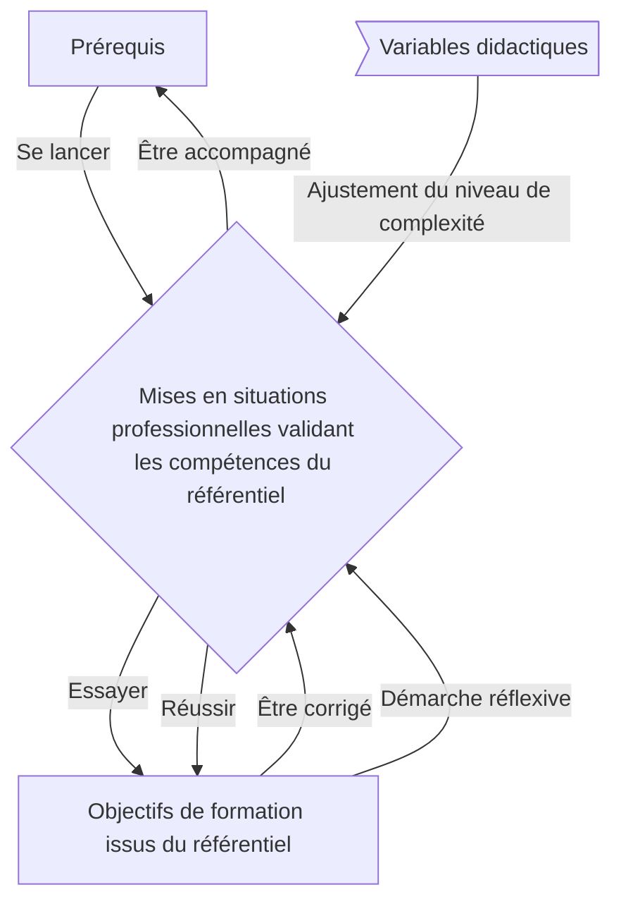
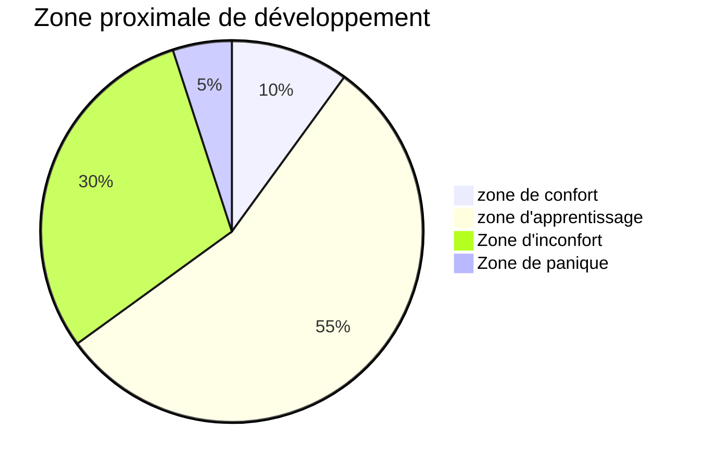

# Apprentissage

## Organisation des mises en situations professionnelles

* 0x : Introduction

* 1x : Mise en place du Lab et des tools

* 2x : Initiation aux protocoles, scripting et outils de sécurité

* 3x : Réseaux, VPN et nomadismes, Cloud

* 4x : Audit, pentest

* 5x : DevSecOps, Microservices, GitHub

* 6x : Hardening

* 7x : Gouvernance, Gestion des risques et des menaces

* 8x : Wireless, RF

* 9x : Hacking, sujets avancés

## Schéma de l'Apprentissage

### En distanciel

Pour que l'apprentissage en distanciel fonctionne, il faut

* Participer
* Rester concentré (pas de distraction)
* Faire appel au formateur si on n’arrive pas à trouver de solution (après avoir cherché par soi-même)
* Mettre la caméra lors des moments d'échange
* Prendre des pauses (si possible sans écran)

## Zone proximale de développement

`zone de confort` -> `zone d'apprentissage` -> `Zone d'inconfort` -> `Zone de panique`

* On vise la **zone d'apprentissage**

* De temps en temps on peut revenir en **zone de confort** pour donner confiance

* Certains apprenants ont besoin d'être poussés ponctuellement en **zone d'inconfort**

* Lorsqu'on pense être en **Zone de panique** il est nécessaire d'en discuter avec le formateur.

## Principe de *Compétence*

Savoir agir en situation.

### Notions de *profondeur des compétences*

* S'acquiert

* Applicable

* Évaluable en s'appuyant sur des critères

* Reconnue par les pairs

### Principe de la *pédagogie active*

On préfère l'expérience et la mise en situation aux cours magistraux.

## Principe d'*approche par compétences*

1. identifier les **situations pro**

2. construire leurs simulations / situations d'apprentissage

3. accompagner l'apprenant dans son action

4. accompagner la démarche réflexive de l'apprenant

## Principe de *variable didactique*

* Elles sont déterminées par le formateur (et non laissée au choix des apprenants) afin de déterminer le niveau de compétence à valider

* Elles diffèrent d'une variable contextuelle: élément sur lequel on ne pourra pas jouer lors de la situation d'apprentissage

## Situation emblématique

`situation professionnelle réelle` -> `situation emblématique` -> `situations d'Apprentissage`

Attention à bien partir d'une `Situation emblématique` et des `Compétences du référentiel` pour couvrir toutes les compétences.

## Montée en compétences

Les `variables didactiques` permettent d'augmenter la complexité.

1. imiter

2. adapter

3. transposer

Objectif: tout niveau 3 pour être certifié, **Critère du REAC = Niveau 3**

## Principe d'analyses réflexives

1. Réfléchissement : Identifier gestes, actions, faiblesses et se projeter éventuellement dans une action future, actuelle ou passée.

2. Analyse réflexive : Vérifier le niveau de compréhension

3. Meta analyse : provoquer un processus d'amélioration continue
