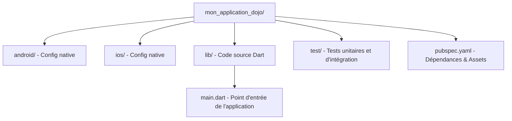

# Flutter basics

## Créer un projet

```sh
flutter create mon_application_dojo
```



## ajouter une dépendance

```sh
# Exemple pour ajouter le package HTTP officiel
flutter pub add http
```

dépendances dans `pubspec.yaml`

```yaml
name: mon_application_dojo
description: "Mon premier projet Flutter Dojo"
version: 1.0.0+1

environment:
  sdk: '>=3.0.0 <4.0.0' # Version de Dart requise

dependencies:
  flutter:
    sdk: flutter
  http: ^1.2.0 # Dépendance ajoutée automatiquement ou manuellement

dev_dependencies:
  flutter_test:
    sdk: flutter
  flutter_lints: ^3.0.0 # Règles d'analyse statique du code
```

## Compilation

> [!NOTE]
> Pour créer des androids virtuuels : Android Studio -> Virtual Device Mangaer

Lister les appareils/émulateurs disponibles

```sh 
flutter devices
```

Exécuter en mode Debug avec support du Hot Reload ('r' dans le terminal)

```sh
flutter run
```

Compiler pour la production (Release)

```sh
flutter build apk  # Pour Android
flutter build ipa  # Pour iOS
flutter build web  # Pour le Web
```

Spécifier les version et build

```sh
flutter build apk --release --build-name=1.1.0 --build-number=2
```

apk dans `build\app\outputs\flutter-apk\`

## Tests

```sh
# Exécuter tous les tests du projet
flutter test

# Exécuter un fichier de test spécifique
flutter test test/widget_test.dart
```
