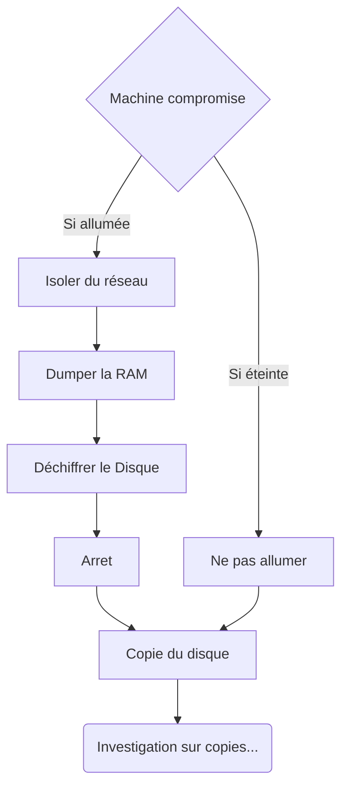

# Detection, Réponse et Forensic

## Ressources

* [Interpol Guidelines](https://www.interpol.int/content/download/16243/file/Guidelines_to_Digital_Forensics_First_Responders_V7.pdf)

* [Cybermalveillance Collecte de preuve](https://www.cybermalveillance.gouv.fr/tous-nos-contenus/document-prestataire/guide-collecte-preuve)

* [MITRE Attack](https://attack.mitre.org/)

## Technologies

* Anti-Virus : Détecte et bloque les logiciels malveillants, principalement par analyse de signatures.

* SIEM (Security Information and Event Management) : Solution permettant de gérer et analyser les évènements.

* EDR (Endpoint Detection and Response) : Signatures, Analyse des événements (comportement, IA), réponse aux menaces.

* XDR (Extended Detection and Response) : Croise les informations entre le réseau et plusieurs Endpoints.


## Traffic Light Protocol (TLP)

### Rouge (TLP RED)

**Pour les yeux et les oreilles des destinataires individuels seulement, aucune autre divulgation.** Les sources peuvent utiliser le TLP:RED lorsque les informations ne peuvent pas être traitées efficacement sans risque significatif pour la vie privée, la réputation ou les opérations des organisations concernées. Les destinataires ne peuvent donc pas partager les informations TLP:RED avec d’autres personnes. Dans le contexte d’une réunion, par exemple, les informations TLP:RED sont limitées aux personnes présentes à la réunion.


### Orange (TLP AMBER)

**Divulgation limitée, les destinataires peuvent diffuser ces informations uniquement sur la base d'un "need to know" au sein de leur organisation et chez leurs clients.** Les sources peuvent utiliser TLP:AMBER lorsque l’information nécessite un soutien pour être traitée efficacement, mais présente un risque pour la vie privée, la réputation ou les opérations si elle est partagée en dehors des organisations concernées. Les destinataires peuvent partager les informations TLP:AMBER avec les membres de leur propre organisation et leurs clients, mais uniquement d'un "need to know" afin de protéger leur organisation et leurs clients et d’éviter tout préjudice supplémentaire. Remarque : si la source souhaite restreindre le partage à l’organisation uniquement, elle doit spécifier TLP:AMBER+STRICT.


### Vert (TLP GREEN)

**La divulgation limitée, les bénéficiaires peuvent la diffuser au sein de leur communauté.** Les sources peuvent utiliser TLP:GREEN lorsque l’information est utile pour accroître la sensibilisation au sein de leur communauté plus large. Les destinataires peuvent partager les informations de TLP:GREEN avec leurs pairs et les organisations partenaires au sein de leur communauté, mais pas via des canaux accessibles au public. Les informations de TLP:GREEN ne peuvent pas être partagées en dehors de la communauté. Note : lorsque le terme "communauté" n’est pas défini, il s’agit par défaut de la communauté de la cybersécurité/défense.


### Clair (TLP Clear)

**Les destinataires peuvent le diffuser dans le monde entier, il n’y a pas de limite à la divulgation.** Les sources peuvent utiliser TLP:CLEAR lorsque l’information présente un risque minimal ou non prévisible d’utilisation abusive, conformément aux règles et procédures applicables à la diffusion publique. Sous réserve des règles standard de copyright, les informations de TLP:CLEAR peuvent être partagées sans restriction.


## Indicateurs de compromission (IoCs)

* [MISP](https://www.misp-project.org/)

* [Abuse.sh](https://abuse.ch/)


## Fuite de Données (DataLeaks)

* BreachForums

* DarkTracer


## Avant intervention

1. Disposer du matériel adéquat : duplicateur (Hardware write blocker), appareil photo, softwares, etc.

2. Disposer des templates de document : timeline, rapport

3. Informer les parties prenantes et faire valider la méthodologie de conservation des preuves en vue d'un dépôt de plainte.

## Pendant intervention

1. Horodater chaque action sur la timeline.

2. Après collecte, toujours travailler sur les copies

## Collecte des preuves



## Copie du Disque

> [!TIP]
> privilégier la copie physique afin de garantir l'intégrité des preuves.

* Intérêt forensique de la copie intégrale (recherche d’artefacts),

* Interopérabilité des formats pour exploitation ultérieure (statique, dynamique, virtualisation),

* Admissibilité judiciaire, force probatoire et traçabilité (rapportde copie, hash).

* **Device to Device (clone)** : This can be performed by obtaining an exact bit-by-bit replica of an original device in another - previously wiped - device with equal or greater capacity.

* **Device to File (image)** : This can be performed by generating one or more files that contain, linked together, an identical copy of the original device. The most widespread is `DD` (`raw`) or `E01` formats

* Copie de mémoire vive (Dump de RAM) : nécessite un support de taille supérieure à celle de la RAM.

* à défaut de copie physique : Privilégier un format interopérable `AD1`.

## à défaut de copie : collecte d'artefacts (souches)

* Toujours mentionner les emplacements physiques / logiques des éléments découverts.

* calculer un hash

* Placer les éléments dans des fichiers .zip avec le mot de passe unique : « infected »

## Eléments à fournir impérativement aux services d'enquêteurs

* Un ensemble de fichiers chiffrés (de types différents)

* La note de rançon dans tous ses formats (txt, hta, html, etc.)

## Calul d'integrité

```powershell
Get-FileHash -alg SHA256 .\Artefact.zip
```

## Ajouter le timestamp au prompt et sauvegarder la session : 

```powershell
function prompt {
    $timestamp = Get-Date -Format "yyyy-MM-ddTHH:mm:ss"
    "$timestamp PS > "
}
Start-Transcript -Path Artefacts/Timeline.txt
```

## Parser des logs json

à l'aide de jq, Filtrer les erreurs ou exceptions

```bash
jq 'select(.level == "error" or .level == "fatal")' logs.json
```

Rechercher des échecs d’authentification

```bash
jq 'select(.message | test("auth.*fail|unauthorized|invalid credentials"; "i"))' logs.json
```

Identifier les accès refusés ou interdits

```bash
jq 'select(.message | test("access denied|forbidden|403"; "i"))' logs.json
```
