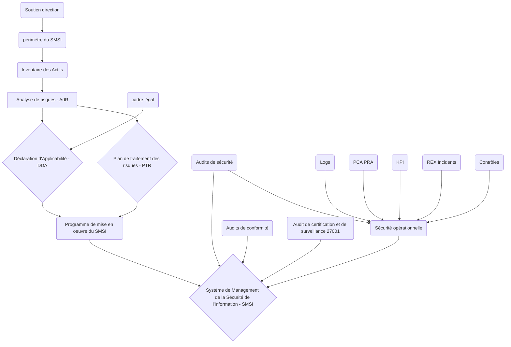
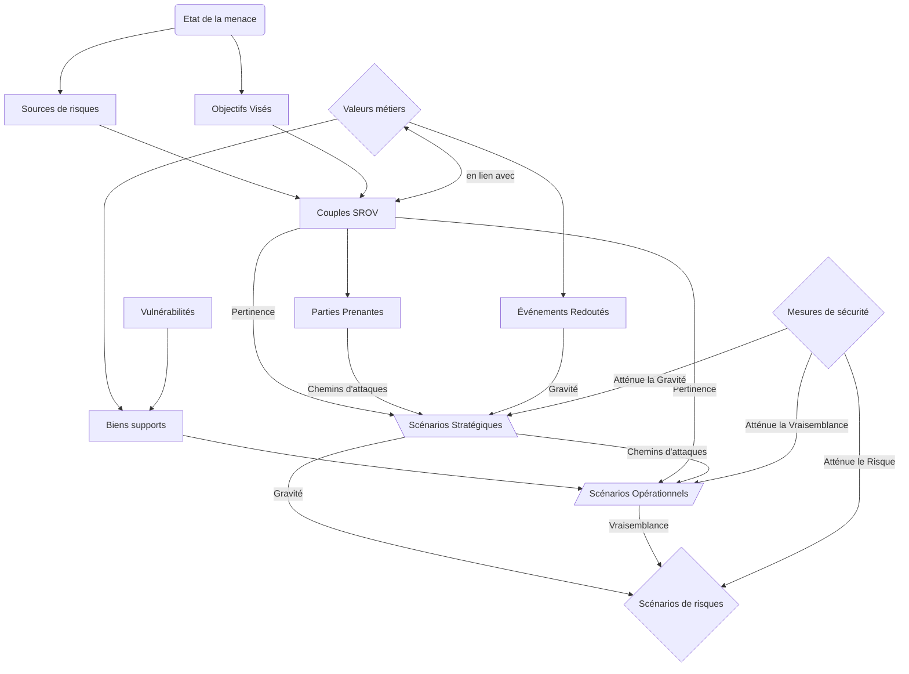
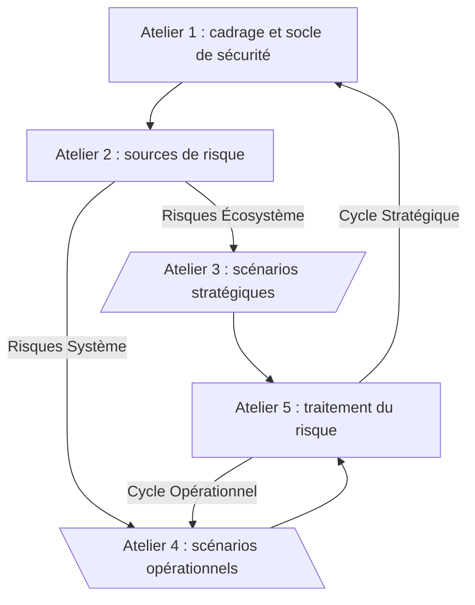

# Governance, Risk, and Compliance (GRC)

## ISO 27001

### Processus Global

```mermaid
flowchart TD
    1(Soutien direction) --> 2(périmètre du SMSI)
    2 -->3(Inventaire des Actifs)
    3 -->4[Analyse de risques - AdR]
    4 -->5{Déclaration d'Applicabilité - DDA}
    4 -->6{Plan de traitement des risques - PTR}
    6 -->7(Programme de mise en oeuvre du SMSI)
    5 -->7(Programme de mise en oeuvre du SMSI)
    7 -->8{Système de Management de la Sécurité de l'Information - SMSI}
    9(Sécurité opérationnelle) --> 8
    10(cadre légal) --> 5
    11(Audits de conformité) --> 8
    12(Audits de sécurité) --> 8
    12-->9
    13(Audit de certification et de surveillance 27001) --> 8
    14(Logs)--> 9
    15(PCA PRA)-->9
    16(KPI)-->9
    17(REX Incidents)-->9
    18(Contrôles)-->9
```

## EBIOS RM

### Processus Global

```mermaid
flowchart TD
    
    0[Parties Prenantes]
    1{Valeurs métiers}
    2[Événements Redoutés]
    1-->2

    3[Sources de risques]
    4[Objectifs Visés]
    5[Couples SROV]
    3-->5
    4-->5
    5-->0
    1<-->|en lien avec|5

    6[Biens supports]
    1-->6
    7[Vulnérabilités]
    7-->6
    6-->8

    8[/Scénarios Opérationnels/]
    9[\Scénarios Stratégiques\]
    5-->|Pertinence|8
    5-->|Pertinence|9
    0-->|Chemins d'attaques|9
    2-->|Gravité|9
    9-->|Chemins d'attaques|8

    10{Scénarios de risques}
    9-->|Gravité|10
    8-->|Vraisemblance|10

    20{Mesures de sécurité}
    20-->|Atténue la Vraisemblance|8
    20-->|Atténue la Gravité|9
    20-->|Atténue le Risque|10

    21(Etat de la menace)
    21-->3
    21-->4
```

### Ateliers

```mermaid
flowchart TD
    1[Atelier 1 : cadrage et socle de sécurité] 
    1--> 2[Atelier 2 : sources de risque]
    2--> | Risques Écosystème| 3[/Atelier 3 : scénarios stratégiques/]
    2--> | Risques Système|4[\Atelier 4 : scénarios opérationnels\]
    3--> 5[Atelier 5 : traitement du risque]
    4--> 5
    5--> |Cycle Opérationnel| 4
    5--> |Cycle Stratégique| 1 
```

