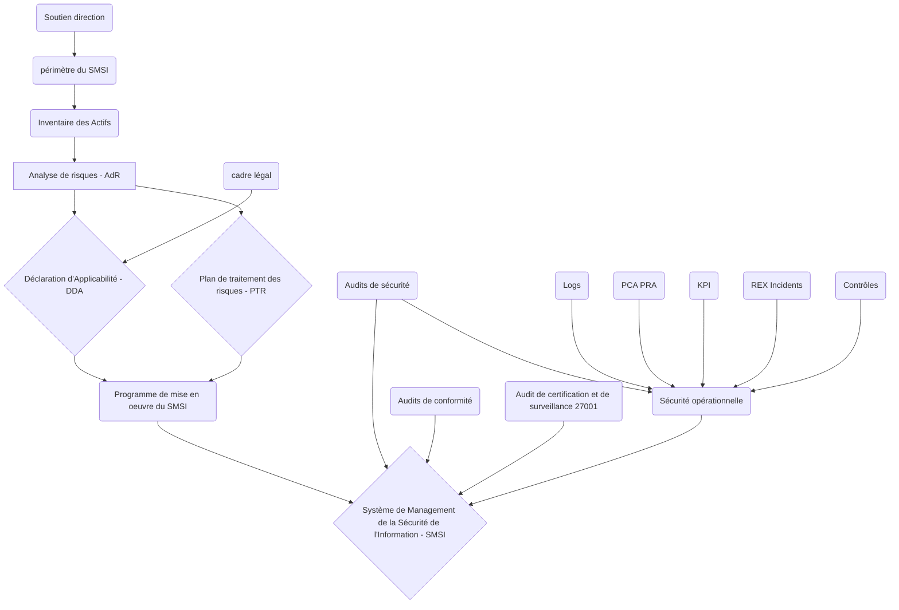
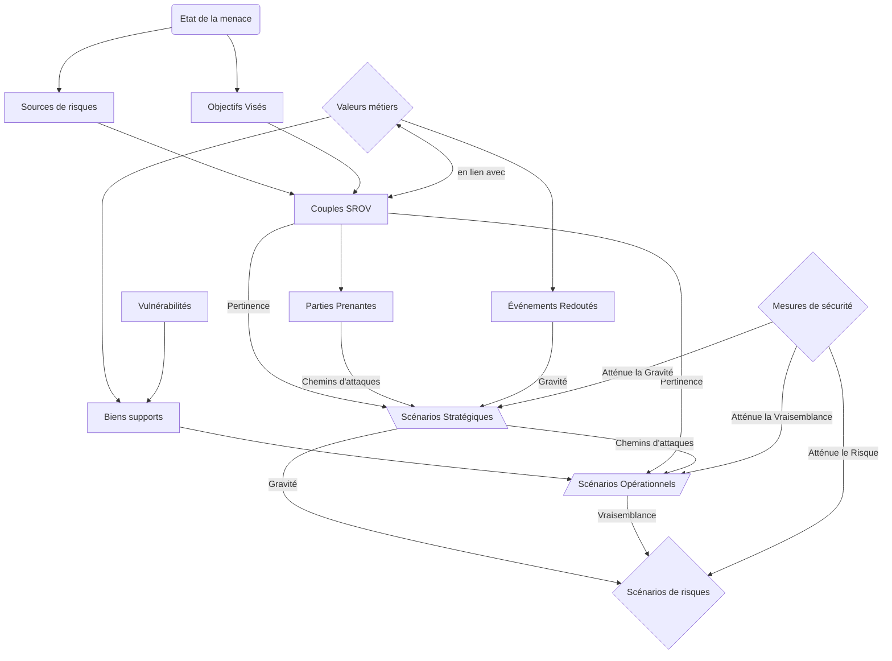
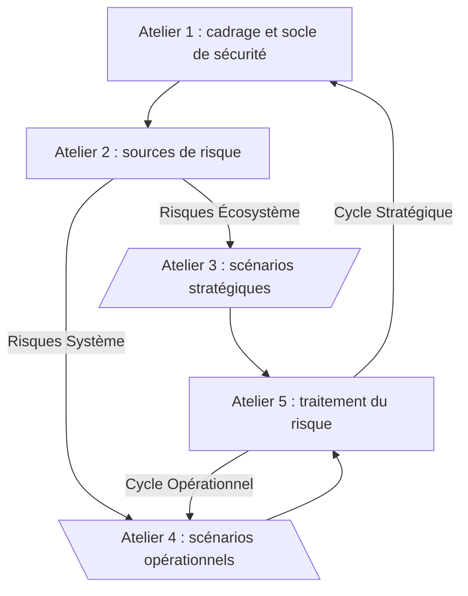

# Governance, Risk, and Compliance (GRC)

## Homologation du SI

### Ressources

* [ANSSI Guide Homologation](https://cyber.gouv.fr/publications/lhomologation-de-securite-des-systemes-dinformation)

* [ANSSI élaboration de PSSI](https://cyber.gouv.fr/publications/pssi-guide-delaboration-de-politiques-de-securite-des-systemes-dinformation)

* [NIST RMF](https://csrc.nist.gov/projects/risk-management/about-rmf)

* [NIST NIST SP 800-53](https://csrc.nist.gov/pubs/sp/800/53/r5/upd1/final)

### Points important PSSI

1. politique de sécurité,
2. organisation de la sécurité,
3. gestion des risques SSI,
4. sécurité et cycle de vie,
5. assurance et certification,
6. aspects humains,
7. planification de la continuité des activités,
8. gestion des incidents,
9. sensibilisation et formation

### Lignes de maitrise

1. Opérationnel (DSI)
2. Support - gestion des risques (RSSI)
3. Contrôle (Comité d'Homologation)
4. Contrôle externe

## La documentation en entreprise (concept anglo-saxon)

### Mandatory 

* Policies : General Management statement
* Standards : Specific Mandatory Controls
* Procedures : Step By Step Instructions

### Discretionary

* Guidelines : Best Practices / Recommendations
* Baselines : Minimal implementation

## Actifs

### Actifs Essentiels

* Informationnels
* Services

### Actifs supports

* Physique (Hardware, Software, immobilier)
* Corporels (personnels avec skills et expérience)
* Incorporels (réputation)

## la classification des SI hébergeant des données sensibles

Dans la pratique, cette  classification est faite dans le cadre d'une stratégie d'homologation.

| Classe | Description |
|----|----|
| Classe 0 | SI public (p. ex. Internet) ou SI connecté à un SI public (p. ex. SI usuel) qui ne respecte pas les exigences de la classe 1. |
| Classe 1 | SI sensible / DR, connecté à Internet au travers d’une passerelle sécurisée (rupture de flux entre deux dispositifs de filtrage, produits qualifiés) satisfaisant les exigences de sécurité définies dans l’II 901. |
| Classe 2 | SI sensible / DR physiquement isolé d’Internet. |

*DR : Diffusion Restreinte*

## Autorités d'Homologation

| Règlementation | Autorité d'Homologation |
|---|---|
| IGI1300 | ANSSI |
| II 2100 (OTAN) | ANSSI |
| IGI 2102 (EU) | ANSSI |
| II901 | Pas d'exigence |
| PSSIE | Pas d'exigence |
| IGI 1337 | Pas d'exigence |
| RGS | Pas d'exigence |
| LPM | Pas d'exigence |

## Les responsabilités dans un contexte Cloud

Consiste à utiliser des ressources distantes le plus souvent au travers d’internet

| Principe | Description |
|----|----|
| Public | ressources partagées et détenu par des tiers |
| Privé | systèmes réservés au client |
| Hybride | Public + Privé |

Répartition des responsabilités entre le fournisseur de services cloud (CSP):

|  | **IaaS** | **PaaS** | **SaaS** |
|---|---|---|---|
| **Applications** | **Client** | **Client** | CSP |
| **Données** | **Client** | **Client** | CSP |
| **Runtime** | **Client** | CSP | CSP |
| **Middleware** | **Client** | CSP | CSP |
| **Système d'exploitation** | **Client** | CSP | CSP |
| **Virtualisation** | CSP | CSP | CSP |
| **Serveurs** | CSP | CSP | CSP |
| **Stockage** | CSP | CSP | CSP |
| **Réseau** | CSP | CSP | CSP |

## ISO 27001

### Processus Global

## CRA et ISO27K1

[Rapport ENISA](https://www.enisa.europa.eu/sites/default/files/2024-11/Cyber%20Resilience%20Act%20Requirements%20Standards%20Mapping%20-%20final_with_identifiers_0.pdf)

| Exigence CRA  | Article CRA  | Contrôle ISO 27001   | Référence ISO |
|----------|--------------|----|----|
| Conception sécurisée   | Art. 6  | Sécurité dès la conception  | A.5.10    |
| Gestion des vulnérabilités  | Art. 12 | Gestion des vulnérabilités  | A.12.1    |
| Mises à jour de sécurité    | Art. 13 | Gestion des changements| A.8.9|
| Confidentialité des données | Art. 10.3c   | Protection des données| A.8.2|
| Authentification et contrôle d’accès   | Art. 10.3b   | Contrôle d’accès | A.5.15    |
| Journalisation et surveillance    | Art. 10.3j   | Surveillance des systèmes   | A.5.17    |
| Notification des incidents  | Art. 11 | Réponse aux incidents | A.5.23    |
| Minimisation des données    | Art. 10.3e   | Minimisation des données    | A.8.3|

## EBIOS RM

### Processus Global

### Ateliers

### Le traitement du risque

Exemple de niveau de risque en fonction de la gravité (ordonnée) et de la vraisemblance (abscisse):

| | Faible | Moyenne | Élevée | Critique |
| --- | --- | --- | --- | --- |
| **Très improbable** | Faible | Faible | Moyen | Élevé |
| **Improbable** | Faible | Moyen | Élevé | Très élevé |
| **Probable** | Moyen | Élevé | Très élevé | Critique |
| **Très probable** | Élevé | Très élevé | Critique | Critique |

* écarter : par exemple, l'arrêt d'un service obsolète
* atténuer (mitigate) : par exemple, la mise en place d'un Firewall applicatif (WAF)
* transférer : par exemple, la migration vers un service cloud qui s'engage contractuellement à couvrir ce risque
* accepter : laisser le risque tel quel est assumer l'impact d'une exploitation par un attaquant

## Les audits de sécurité

Les activités couvertes par le référentiel PASSI :

- audit d’architecture (ARCHI);
- audit de configuration (CONF);
- audit de code source (CODE);
- test d’intrusion (PENTEST);
- audit organisationnel et physique (ORGAPHY)

[Source PASSI](https://cyber.gouv.fr/actualites/appel-public-commentaires-sur-la-mise-jour-du-referentiel-passi)

## Souveraineté

[Dossier technique du Clusif](https://clusif.fr/wp-content/uploads/2025/01/20240627-Souverainete-et-confiance-numerique.pdf)

*La souveraineté numérique peut être définie comme un concept essentiel visant à garantir la préservation des intérêts fondamentaux d’un État, ainsi que ceux de ses organisations nationales et de leurs utilisateurs en matière de services et de protection des données. La souveraineté numérique permet de répondre à l’impérieux besoin d’indépendance, d’autonomie stratégique, de résilience et d’immunité face aux menaces institutionnalisées provenant de puissances étrangères.*

### Critères de souveraineté

Technique :

* Localisation des datacenters
* Localisation des données (transit, repos, utilisation)
* Localisation des services et applications tierces
* Localisation des sous-traitants
* Localisation des personnes à privilèges
* Localisation des supervisions et sauvegardes
* Localisation du siège de la société

Juridique :

* Certification de l'hébergeur
* Nationalité de l'hébergeur
* Nationalité du personnel ayant accès
* Nationalité des fonds de capitaux
* Montage juridique de la société
* Nationalité des produits et services utilisés
