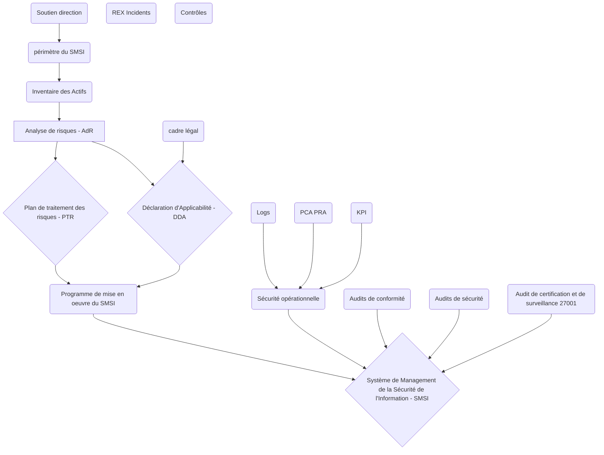
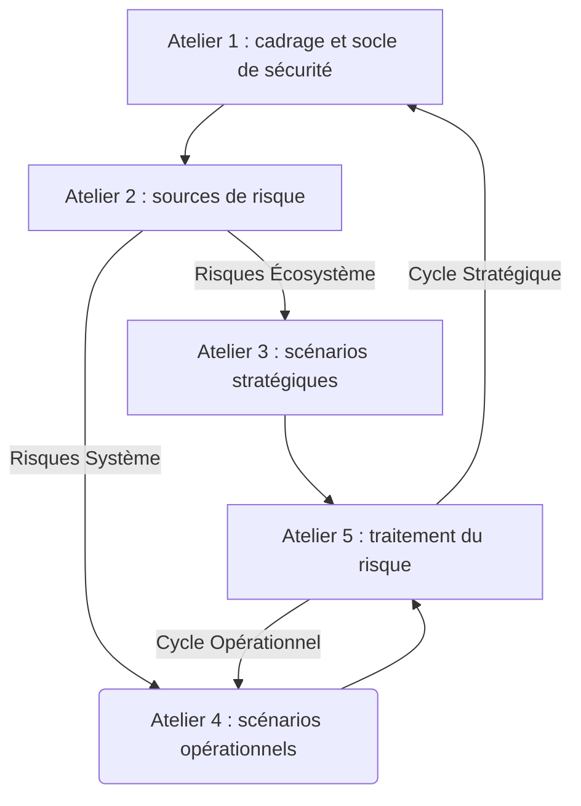

# Governance, Risk, and Compliance (GRC)

## ISO 27001

```mermaid
flowchart TD
    1(Soutien direction) --> 2(périmètre du SMSI)
    2 -->3(Inventaire des Actifs)
    3 -->4[Analyse de risques - AdR]
    4 -->5{Déclaration d'Applicabilité - DDA}
    4 -->6{Plan de traitement des risques - PTR}
    6 -->7(Programme de mise en oeuvre du SMSI)
    5 -->7(Programme de mise en oeuvre du SMSI)
    7 -->8{Système de Management de la Sécurité de l'Information - SMSI}
    9(Sécurité opérationnelle) --> 8
    10(cadre légal) --> 5
    11(Audits de conformité) --> 8
    12(Audits de sécurité) --> 8
    13(Audit de certification et de surveillance 27001) --> 8
    14(Logs)--> 9
    15(PCA PRA)-->9
    16(KPI)-->9
    17(REX Incidents)
    18(Contrôles)
```

## EBIOS RM

```mermaid
flowchart TD
    1[Atelier 1 : cadrage et socle de sécurité] 
    1--> 2[Atelier 2 : sources de risque]
    2--> | Risques Écosystème| 3[Atelier 3 : scénarios stratégiques]
    2--> | Risques Système|4(Atelier 4 : scénarios opérationnels)
    3--> 5[Atelier 5 : traitement du risque]
    4--> 5
    5--> |Cycle Opérationnel| 4
    5--> |Cycle Stratégique| 1 
```