# Governance, Risk, and Compliance (GRC)

## Homologation du SI

### Ressources

* [ANSSI Guide Homologation](https://cyber.gouv.fr/publications/lhomologation-de-securite-des-systemes-dinformation)

* [ANSSI élaboration de PSSI](https://cyber.gouv.fr/publications/pssi-guide-delaboration-de-politiques-de-securite-des-systemes-dinformation)

* [NIST RMF](https://csrc.nist.gov/projects/risk-management/about-rmf)

* [NIST NIST SP 800-53](https://csrc.nist.gov/pubs/sp/800/53/r5/upd1/final)

### Points important PSSI

1. politique de sécurité,
2. organisation de la sécurité,
3. gestion des risques SSI,
4. sécurité et cycle de vie,
5. assurance et certification,
6. aspects humains,
7. planification de la continuité des activités,
8. gestion des incidents,
9. sensibilisation et formation

### Lignes de maitrise

1. Opérationnel (DSI)
2. Support - gestion des risques (RSSI)
3. Contrôle (Comité d'Homologation)
4. Contrôle externe

## La documentation en entreprise (concept anglo-saxon)

### Mandatory

* Policies : General Management statement
* Standards : Specific Mandatory Controls
* Procedures : Step By Step Instructions

### Discretionary

* Guidelines : Best Practices / Recommendations
* Baselines : Minimal implementation

## Actifs

### Actifs Essentiels

* Informationnels
* Services

### Actifs supports

* Physique (Hardware, Software, immobilier)
* Corporels (personnels avec skills et expérience)
* Incorporels (réputation)

## la classification des SI hébergeant des données sensibles

Dans la pratique, cette  classification est faite dans le cadre d'une stratégie d'homologation.

| Classe | Description |
|----|----|
| Classe 0 | SI public (p. ex. Internet) ou SI connecté à un SI public (p. ex. SI usuel) qui ne respecte pas les exigences de la classe 1. |
| Classe 1 | SI sensible / DR, connecté à Internet au travers d’une passerelle sécurisée (rupture de flux entre deux dispositifs de filtrage, produits qualifiés) satisfaisant les exigences de sécurité définies dans l’II 901. |
| Classe 2 | SI sensible / DR physiquement isolé d’Internet. |

DR : *Diffusion Restreinte*

## Autorités d'Homologation

| Règlementation | Autorité d'Homologation |
|---|---|
| IGI1300 | ANSSI |
| II 2100 (OTAN) | ANSSI |
| IGI 2102 (EU) | ANSSI |
| II901 | Pas d'exigence |
| PSSIE | Pas d'exigence |
| IGI 1337 | Pas d'exigence |
| RGS | Pas d'exigence |
| LPM | Pas d'exigence |

## Les responsabilités dans un contexte Cloud

Consiste à utiliser des ressources distantes le plus souvent au travers d’internet

| Principe | Description |
|----|----|
| Public | ressources partagées et détenu par des tiers |
| Privé | systèmes réservés au client |
| Hybride | Public + Privé |

Répartition des responsabilités entre le fournisseur de services cloud (CSP):

|  | **IaaS** | **PaaS** | **SaaS** |
|---|---|---|---|
| **Applications** | **Client** | **Client** | CSP |
| **Données** | **Client** | **Client** | CSP |
| **Runtime** | **Client** | CSP | CSP |
| **Middleware** | **Client** | CSP | CSP |
| **Système d'exploitation** | **Client** | CSP | CSP |
| **Virtualisation** | CSP | CSP | CSP |
| **Serveurs** | CSP | CSP | CSP |
| **Stockage** | CSP | CSP | CSP |
| **Réseau** | CSP | CSP | CSP |

## ISO 27001

```mermaid
flowchart TD
    1(Soutien direction) --> 2(périmètre du SMSI)
    2 -->3(Inventaire des Actifs)
    3 -->4[Analyse de risques - AdR]
    4 -->5{Déclaration d'Applicabilité - DDA}
    4 -->6{Plan de traitement des risques - PTR}
    6 -->7(Programme de mise en oeuvre du SMSI)
    5 -->7(Programme de mise en oeuvre du SMSI)
    7 -->8{Système de Management de la Sécurité de l'Information - SMSI}
    9(Sécurité opérationnelle) --> 8
    10(cadre légal) --> 5
    11(Audits de conformité) --> 8
    12(Audits de sécurité) --> 8
    12-->9
    13(Audit de certification et de surveillance 27001) --> 8
    14(Logs)--> 9
    15(PCA PRA)-->9
    16(KPI)-->9
    17(REX Incidents)-->9
    18(Contrôles)-->9
```

## CRA et ISO27K1

[Rapport ENISA](https://www.enisa.europa.eu/sites/default/files/2024-11/Cyber%20Resilience%20Act%20Requirements%20Standards%20Mapping%20-%20final_with_identifiers_0.pdf)

| Exigence CRA  | Article CRA  | Contrôle ISO 27001   | Référence ISO |
|----------|--------------|----|----|
| Conception sécurisée   | Art. 6  | Sécurité dès la conception  | A.5.10    |
| Gestion des vulnérabilités  | Art. 12 | Gestion des vulnérabilités  | A.12.1    |
| Mises à jour de sécurité    | Art. 13 | Gestion des changements| A.8.9|
| Confidentialité des données | Art. 10.3c   | Protection des données| A.8.2|
| Authentification et contrôle d’accès   | Art. 10.3b   | Contrôle d’accès | A.5.15    |
| Journalisation et surveillance    | Art. 10.3j   | Surveillance des systèmes   | A.5.17    |
| Notification des incidents  | Art. 11 | Réponse aux incidents | A.5.23    |
| Minimisation des données    | Art. 10.3e   | Minimisation des données    | A.8.3|

## CRA

Exigences techniques

| Id | Exigence|
|----|-----|
| 1  | Conception sécurisée |
| 2  | Protection contre accès non autorisé |
| 3  | Contrôle d’authentification  |
| 4  | Protection des données  |
| 5  | Limitation des attaques |
| 6  | Protection contre les injections  |
| 7  | Sécurité des communications  |
| 8  | Sécurité des mises à jour    |
| 9  | Journalisation des événements|
| 10 | Protection contre les altérations |
| 11 | Sécurité par défaut|
| 12 | Séparation des privilèges    |
| 13 | Résilience aux défaillances  |

Exigences de vulnérabilité  

| Id | Exigence |
|----|-----|
| 1  | Processus de gestion des vulnérabilités |
| 2  | Surveillance continue |
| 3  | Réaction rapide |
| 4  | Mises à jour de sécurité|
| 5  | Notification des incidents à l’ENISA sous 24h |
| 6  | Communication avec les utilisateurs |
| 7  | Canal de divulgation pour les chercheurs en sécurité|
| 8  | Documentation technique à jour |

## EBIOS RM

```mermaid
flowchart TD
    
    0[Parties Prenantes]
    1{Valeurs métiers}
    2[Événements Redoutés]
    1-->| en lien avec|2

    3[Sources de risques]
    4[Objectifs Visés]
    5[Couples SROV]
    3-->|Ressources|5
    4-->|Motivations|5
    5-->0
    1-->|en lien avec|5

    6[Biens supports]
    1-->|s'appuie sur|6
    7[Vulnérabilités]
    7-->|contenues dans|6
    6-->|Chemins opérationnels|8

    8[/Scénarios Opérationnels/]
    9[\Scénarios Stratégiques\]
    5-->|Pertinence|8
    5-->|Pertinence|9
    0-->|Chemins stratégiques|9
    2-->|Gravité|9
    9-->|Chemins opérationnels|8

    10{Scénarios de risques}
    9-->|Gravité|10
    8-->|Vraisemblance|10

    20{Mesures de sécurité}
    20-->|Atténue la Vraisemblance|8
    20-->|Atténue la Gravité|9
    20-->|Atténue le Risque|10

    21(Etat de la menace)
    21-->|Menaces connues|3
    21-->|Activités connues|4
```

### Ateliers

```mermaid
flowchart TD
    1[Atelier 1 : cadrage et socle de sécurité] 
    1--> 2[Atelier 2 : sources de risque]
    2--> | Risques Écosystème| 3[/Atelier 3 : scénarios stratégiques/]
    2--> | Risques Système|4[\Atelier 4 : scénarios opérationnels\]
    3--> 5[Atelier 5 : traitement du risque]
    4--> 5
    5--> |Cycle Opérationnel| 4
    5--> |Cycle Stratégique| 1 
```

### Le traitement du risque

* écarter : par exemple, l'arrêt d'un service obsolète
* atténuer (mitigate) : par exemple, la mise en place d'un Firewall applicatif (WAF)
* transférer : par exemple, la migration vers un service cloud qui s'engage contractuellement à couvrir ce risque
* accepter : laisser le risque tel quel est assumer l'impact d'une exploitation par un attaquant

Exemple de matrice de risque :

| Vraisemblance / Gravité | Faible | Moyenne | Élevée | Critique |
|-------------------------|--------|---------|--------|-----------|
| **Très probable**       | 🟠 | 🔴 | 🔴 | 🔴 |
| **Probable**            | 🟠 | 🟠 | 🔴 | 🔴 |
| **Improbable**          | 🟢 | 🟠 | 🟠 | 🔴 |
| **Très improbable**     | 🟢 | 🟢 | 🟠 | 🟠 |

* 🟢 Moyen
* 🟠 Élevé
* 🔴 Critique

## Les audits de sécurité

Les activités couvertes par le référentiel PASSI :

* audit d’architecture (ARCHI);
* audit de configuration (CONF);
* audit de code source (CODE);
* test d’intrusion (PENTEST);
* audit organisationnel et physique (ORGAPHY)

[Source PASSI](https://cyber.gouv.fr/actualites/appel-public-commentaires-sur-la-mise-jour-du-referentiel-passi)

## Souveraineté

[Dossier technique du Clusif](https://clusif.fr/wp-content/uploads/2025/01/20240627-Souverainete-et-confiance-numerique.pdf)

*La souveraineté numérique peut être définie comme un concept essentiel visant à garantir la préservation des intérêts fondamentaux d’un État, ainsi que ceux de ses organisations nationales et de leurs utilisateurs en matière de services et de protection des données. La souveraineté numérique permet de répondre à l’impérieux besoin d’indépendance, d’autonomie stratégique, de résilience et d’immunité face aux menaces institutionnalisées provenant de puissances étrangères.*

### Critères de souveraineté

Technique :

* Localisation des datacenters
* Localisation des données (transit, repos, utilisation)
* Localisation des services et applications tierces
* Localisation des sous-traitants
* Localisation des personnes à privilèges
* Localisation des supervisions et sauvegardes
* Localisation du siège de la société

Juridique :

* Certification de l'hébergeur
* Nationalité de l'hébergeur
* Nationalité du personnel ayant accès
* Nationalité des fonds de capitaux
* Montage juridique de la société
* Nationalité des produits et services utilisés

## NIST RMF (Risk Management Framework)

```mermaid
graph TD
    A[Prepare] -->|Définir rôles, politiques, ressources| B[Categorize]
    B -->|Évaluer impact sur confidentialité, intégrité, disponibilité| C[Select]
    C -->|Choisir contrôles adaptés NIST SP 800-53| D[Implement]
    D -->|Déployer et documenter les contrôles| E[Assess]
    E -->|Tester l'efficacité des contrôles| F[Authorize]
    F -->|Décider d'autoriser le système| G[Monitor]
    G -->|Surveillance continue, mises à jour| A
```

