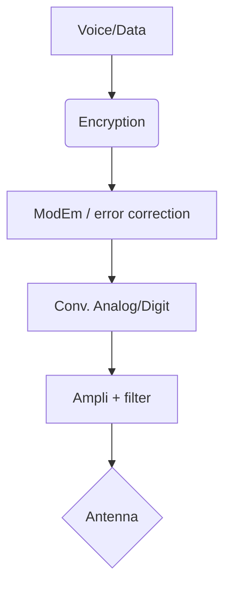
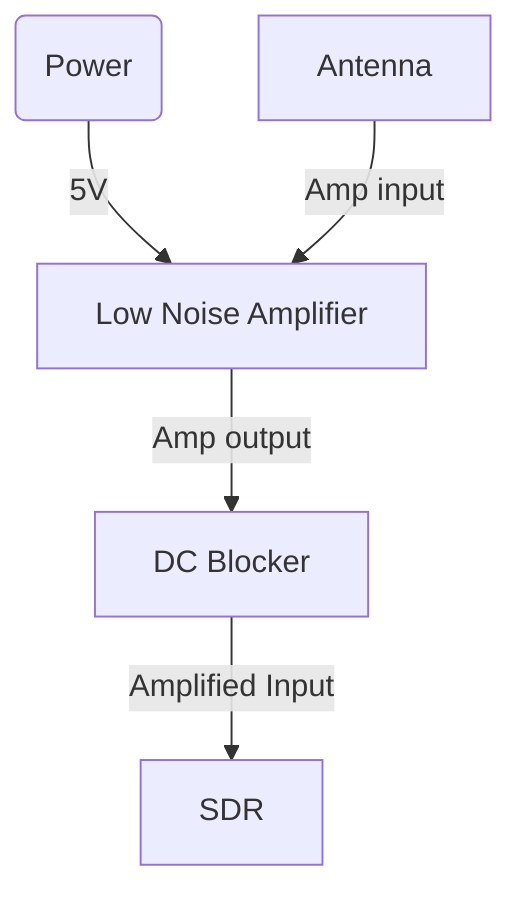
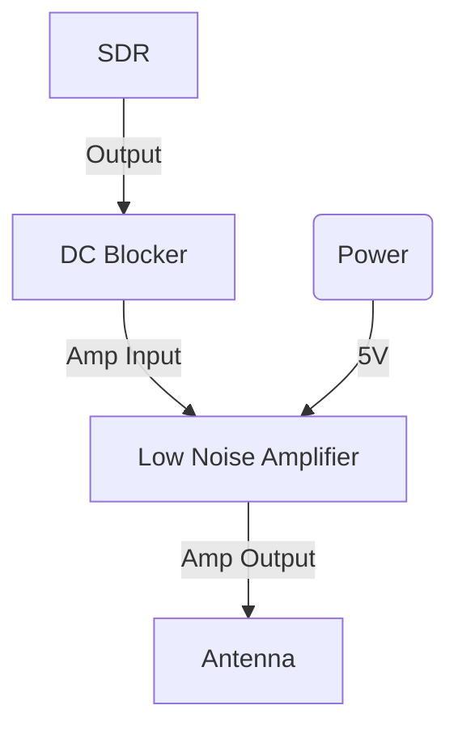

# RF et RF Security basics

## definitions

| terme | definition |
|-------|---------|
| λ | longueur d'onde |
| v ou f | frequence |
| T | temps |
| E | Emission |
| R | Reception
| if_freq | fréquence intermediaire avant E ou Apres R |
| lo_freq | frequance de l'oscilateur local |
| LO + FI | Frequence E/R |
| LNA | Low noise ampli. (ampli en entrée de reception) |
| VGA | Variable Gain Amplifiers |
| Base band | signal utile ou bande de base |
| Sample rate | fréquence d'échantillonnage (pour passer d'analogique à numérique) |
| FFT | Fast Fourier transform, permet de convertir une suite nombres complexes en Frequences |
| Procédure | c’est un ensemble de règles qui fixent la forme et la succession des émissions, dans le but de garantir la REGULARITE et la RAPIDITE d’acheminement du trafic et d’assurer la SECURITE des transmissions. L’inobservation de ces règles provoque l’inefficacité, des indiscrétions, de la confusion et un manque de rapidité opérationnelle. |
| Station | c’est un ensemble d’appareils et de personnels placés sous l’autorité d’un chef de station, mis à la disposition d’une ou plusieurs autorités en vue de réaliser une ou plusieurs liaisons. |
| Réseau | C’est un ensemble de stations (radio, FH, TG) qui travaillent entre elles suivants les mêmes règles imposées et les mêmes caractéristiques (fréquences, indicatifs, modulation).
| Indicatif | n appelle indicatif, un ensemble de lettres ou de chiffres, ou de lettres et de chiffres mélangés pouvant désigner soit une station (ou un groupe de stations) soit une autorité (ou un groupe d’autorités). | 
| SDR | Software-Defined Radio |
| DSP | Digital Signal Processing |


## Critères de Compatibilité éléctromagnetique (CEM):

1. Emissivité
2. Immunité

## Surface d'attaque

* Emissions electromagnetique : side channel, cryptanalyse, TEMPEST 
* Susceptibilité éléctromagnetique : emissions parasites, AGREMI

## Menaces

* Interceptions (ex: Man in the middle)
* Ecoutes
* Localisation
* Neutralisation (brouillage, sabotage)
* Déception (Intrusion, Leurre)

## Recommandations

* Choix des moyens (choix de la puissance d’émission, des antennes …)
* Réduction des durées d’émissions (préparation des communications)
* Respect procédures (chiffrement, protocoles)
* Choix de l’emplacement d'émission
* Tester (simuler les evenements redoutés) et améliorer


## Mise en oeuvre

1. Vérifier l’arrêt puis,
2. ANTACAL : ANTenne ACcessoires ALimentation
3. Utiliser des cables blindés sous peine d'avoir un signal de mauvaise qualité

```
Pour les ER avec forte puissance d'émission:
NE JAMAIS EMETTRE SANS ANTENNE
NE JAMAIS TOUCHER L’ANTENNE EN EMISSION
```

## Fréquence et longueur d'onde

Permets notamment d'en déduire la taille de l'antenne

`λ = c/f = c*T` 

* λ est la longueur d'onde en mètre (m),
* c la célérité de propagation de l'onde en mètre par seconde (m.s-1) = 299,792,458 mètres par seconde 
* f la fréquence (Hz)
* T la période (s).

```powershell
function Get-AntSize {
        <#
    .SYNOPSIS
        λ = c/f

    .DESCRIPTION
        Conversion Frequence -> Longeur d'antenne Quart d'onde

    .PARAMETER frequency
        Frequence en Hz

    .OUTPUTS
        Longueur d'ondes en metre et  taille de l'antenne quart d'onde en cm.

    .EXAMPLE
        $antennaSize = Get-AntennaSize -frequency 915000000 # pour une fréquence de 915 MHz
    #>

    param (
        [Parameter(Mandatory=$true)]
        [double]$frequency
    )

    $speedOfLight = 299792458 # célérité
    $wavelength = $speedOfLight / $frequency # calculer la longueur d'onde
    $antennaSize = ($wavelength / 4) * 100 # pour une antenne quart d'onde et en centimtre

    Write-Host("λ (m) : $wavelength") -ForegroundColor DarkGray
    Write-Host("Ant (cm) : $antennaSize") -ForegroundColor White

}
```


## SDR software define radio



## Modulations

| Type | Designation | Description | Cas d'usage |
|------|-------------|-------------|-------------|
| Amplitude | AM | modulation d'amplitude | Radio Analogique "grandes ondes"|
| Amplitude | ASK | Shift Keying | |
| Frequence | FM | modulation de freq. | Radio Analogique |
| Frequence | FSK | Shift Keying | RFID |
| Frequence | GFSK | guaussian (signal plus propre) | Bluetooth |
| Phase | BPSK | simple 2 état à 180° |  |
| Phase | QPSK | Quadrature |  |
| Phase | GMSK| Gaussian minimum-shift keying  | GSM |
| Amplitude+Phase | QAM | Quadrature - completé par nombre de bits | TNT |
| autre | OFDM | Orthogonal Frequency-division multiplexing | sous porteuse espacé en Freq qui utilisent d'autres modulations (BPSK, QPSK, QAM-16, QAM-64…) | UMTS,LTE, CPL, Wifi |
| autre | OOK | Binaire (On-Off Key) | télécommandes et morse |
| autre | USB | Upper Side Band = Bande Latérale Supérieure ||
| autre | LSB | Lower Side Band = Bande Latérale Inférieure ||
| autre | SSB | Single Side Band = Bande Latérale Unique (BLU) ||


### Exemple de modulation BFSK random via DSP : 

```python
#!/usr/bin/env python
# from: https://pysdr.org/content/iq_files.html, modifié pour hackrf

import sys
import numpy as np
import matplotlib.pyplot as plt

def write_iq(iqfile):
    """
    In Python, and numpy specifically, we use the tofile() function to store a numpy array to a file. 
    Here is a short example of creating a simple BPSK signal plus noise and saving it to a file in the same directory we ran our script from:
    """

    num_symbols = 10000
    x_symbols = np.random.randint(0, 2, num_symbols)*2-1 # -1 and 1's
    r = x_symbols

    # NOISE (comment if not needed)
    n = (np.random.randn(num_symbols) + 1j*np.random.randn(num_symbols))/np.sqrt(2) # AWGN with unity power
    r = x_symbols + n * np.sqrt(0.01) # noise power of 0.01

    # plot
    print(r)
    plt.plot(np.real(r), np.imag(r), '.')
    plt.grid(True)
    plt.show()

    # Now save to an IQ file
    r = r.astype(np.complex64) # Convert to 64
    r.tofile(iqfile +'.iq')
    """
    to Read the file:
    samples = np.fromfile('bpsk_in_noise.iq', np.complex64)
    """

    # file for hackrf one
    output_int = np.empty((len(r) * 2,), dtype=np.int8)
    output_int[0::2] = np.round(r.real)
    output_int[1::2] = np.round(r.imag)
    output_int.tofile(iqfile + ".cs8")

if __name__ == "__main__":
    write_iq("out")
```


## Encodage

NRZ, NRZI, Manchester, Miller, bipolaires

## Antennes

* Verticales omnidirectionnelles à λ/2 ou λ/4

* Directionnelles avec directeurs, radiateur et réflecteur ex: Yagi

* Dipôles

* Parabolique (ex: reception sattelite)

* Loop et cadre magnétique (ex: RFID)

## informations sur les produits et les protocoles

* [FCC](https://www.fcc.gov/)

## Tools

* [SDRSharp (SDR#)](https://airspy.com/download/) : analyse de spectre et démodulations audio (analogique) et plugins pour numérique
* [GNU Radio](https://www.gnuradio.org/) / [Radioconda](https://github.com/ryanvolz/radioconda) : flow mod / demod
* [SDRAngel](https://www.sdrangel.org/), Universal Radio Hacker : analyse de spectre, analyse de capture / fichiers pour démoduler des signaux numériques
* [PothosSDR](https://www.pothosware.com/) : flow
* [SoapySDR](https://github.com/pothosware/SoapySDR/wiki) : API
* [qt-Dab](https://github.com/JvanKatwijk/qt-dab/releases) : Radio Numerique Terrestre (RNT DAB+) - rester en version 2.7 pour windows
* [URH](https://github.com/jopohl/urh): Analyse / reverse
* [Inspectrum](https://github.com/ryanvolz/radioconda) fourni avec radioconda : Analyse 

## signaux

### Formule du signal sinusoïdal : 


s(t) = A sin (w * t + phi)

* s : signal
* t : temps
* A : Amplitude (V)
* wt + phi : Phase instantanée (rad)
* phi : phase à l'originae (rad)

### Stockage en nombre complexe

I (axe y) : Partie Imaginaire : Ampliture en phase, `cos(phi)`
Q (axe x): partie réele : Amplitude en Quadrature, coté initial, `sin(phi)`

* phi : angle de phase du signal 
* Apmplitude totale via pythagore : Racine carré(I^2 + Q^2) 


## formats de fichiers

* IQ = écriture en nombre complexe (I+jQ)

| Format | Description |
|--------|-------------|
| .cu4   | Complex (I/Q), Unsigned integer, 4-bit per value (8 bit per sample) |
| .cs4   | Signed integer |
| .cu8 (.data .complex16u) | 8-bit per value (16 bit per sample) - Complex 8-bit unsigned integer samples (RTL-SDR) |
| .cs8 (.complex16s) | |
| .cu12  | 12-bit per value (24 bit per sample) |
| .cs12  | |
| .cu16  | 16-bit per value (32 bit per sample) |
| .cs16  | Complex 16-bit signed integer samples (BladeRF) |
| .cu32  | 32-bit per value (64 bit per sample) |
| .cs32  | |
| .cu64  | 64-bit per value (128 bit per sample) |
| .cs64  | |
| .cf32 (.cfile .complex) | Float, 32-bit per value (64 bit per sample) - Complex 32-bit floating point samples (GNURadio, osmocom_fft) |
| .cf64  | Double Float, 64-bit per value (128 bit per sample) |

### convertir les fichiers:

Convert the file from unsigned 8-bit integers to 32-bit floats. This can be done with:

```powershell

PS > C:\Program` Files` `(x86`)\sox-14-4-2\sox.exe .\wifi-like.s8 wifilike.f32

C:\Program Files (x86)\sox-14-4-2\sox.exe WARN raw: `.\wifi-like.s8': sample rate not specified; trying 8kHz
C:\Program Files (x86)\sox-14-4-2\sox.exe WARN raw: `.\wifi-like.s8': # channels not specified; trying mono

PS > ls *.f32

 Répertoire : C:\Users\vaca\OneDrive\Documents\Projets-InfoSec\Keisei-sanshoku\ER\OpenER
Mode                 LastWriteTime         Length Name
----                 -------------         ------ ----
-a----        24/03/2023     09:19     1858076672 wifilike.f32
```


## Numpy & co

lire la partie réelle et imaginaire des IQ : 

```python
def read_img_real(input_file):

    print("[*] Reading IQ and real parts...")
    try:
        # Lecture optimisée via numpy.memmap
        data = np.memmap(input_file, dtype=np.int8, mode='r')

        # Les données alternent entre la partie réelle et imaginaire
        real = data[0::2]
        imag = data[1::2]

        # Échantillonnage des données (si trop volumineux)
        step = max(1, len(real) // 2000)  # Limite à 2000 points affichés
        plt.figure(figsize=(10, 6))
        plt.plot(real[::step], label="Partie Réelle (échantillon)", color="blue")
        plt.title("Signal en baseband - Partie Réelle")
        plt.xlabel("Échantillons")
        plt.ylabel("Amplitude")
        plt.legend(loc="upper right")
        plt.grid()
        plt.show()

        plt.figure(figsize=(10, 6))
        plt.plot(imag[::step], label="Partie Imaginaire (échantillon)", color="red")
        plt.title("Signal en baseband - Partie Imaginaire")
        plt.xlabel("Échantillons")
        plt.ylabel("Amplitude")
        plt.legend(loc="upper right")
        plt.grid()
        plt.show()

        # Libération explicite de la mémoire
        del data, real, imag
        gc.collect()

    except FileNotFoundError:
        print(f"file {input_file} not found")
    except Exception as e:
        print(f"Error:\n{str(e)}")

```

Transformation de Fourrier (FFT :)

```python

def read_fft(input_file):

    print("[*] FFT...")
    try:
        # Lecture optimisée via numpy.memmap
        data = np.memmap(input_file, dtype=np.int8, mode='r')

        # Les données alternent entre la partie réelle et imaginaire
        real = data[0::2].astype(np.float32)  # Conversion en float32
        imag = data[1::2].astype(np.float32)  # Conversion en float32
        iq_signal = real + 1j * imag

        # Taille optimale pour la FFT
        optimal_size = 2**np.ceil(np.log2(len(iq_signal))).astype(int)
        iq_signal = np.pad(iq_signal, (0, optimal_size - len(iq_signal)), mode='constant')

        # Utilisation de pyFFTW pour accélérer la FFT
        fft_object = pyfftw.builders.fft(iq_signal, threads=4)  # Utilisation de 4 threads
        fft_signal = pyfftw.interfaces.numpy_fft.fftshift(fft_object())
        fft_magnitude = 20 * np.log10(np.abs(fft_signal))

        # Échantillonnage pour l'affichage graphique
        step = max(1, len(fft_magnitude) // 1000)  # Limite à 1000 points affichés
        plt.figure(figsize=(10, 6))
        plt.plot(fft_magnitude[::step], label="Spectre du Signal (FFT)", color="green")
        plt.title("Spectre en Fréquence (FFT)")
        plt.xlabel("Fréquence (échantillons)")
        plt.ylabel("Amplitude (dB)")
        plt.legend(loc="upper right")
        plt.grid()
        plt.show()

        # Libération explicite de la mémoire
        del data, real, imag, iq_signal, fft_signal, fft_magnitude
        gc.collect()

    except FileNotFoundError:
        print(f"file {input_file} not found")
    except Exception as e:
        print(f"Error:\n{str(e)}")


```

Amplitude en fonction du temps (S(t))

```python


def read_amplitude(input_file, sampling_rate=8000000): #default sample rate = 8000000 (cf. script qui créé le CS8 à transmettre)

    print("[*] Amp vs Time...")
    try:
        # Lecture optimisée via numpy.memmap
        data = np.memmap(input_file, dtype=np.int8, mode='r')

        # Extraction des parties réelle et imaginaire avec conversion
        real = data[0::2].astype(np.float32)  # Conversion en float32 pour compatibilité
        imag = data[1::2].astype(np.float32)
        iq_signal = real + 1j * imag

        # Calcul rapide de l'amplitude complexe
        amplitude = np.abs(iq_signal)

        # Création de l'axe temporel (éviter de calculer un par un)
        time = np.linspace(0, len(amplitude) / sampling_rate, num=len(amplitude))

        # Optimisation de l'affichage avec échantillonnage
        step = max(1, len(amplitude) // 4000)  # Afficher 4000 points maximum
        plt.figure(figsize=(10, 6))
        plt.plot(time[::step], amplitude[::step], label="Amplitude du Signal", color="purple")
        plt.title("Amplitude du Signal en Fonction du Temps")
        plt.xlabel("Temps (s)")
        plt.ylabel("Amplitude")
        plt.legend(loc="upper right")
        plt.grid()
        plt.show()

        # Libération explicite des ressources
        del data, real, imag, iq_signal, amplitude, time
        gc.collect()

    except FileNotFoundError:
        print(f"Fichier introuvable : {input_file}")
    except ValueError:
        print("Erreur de type dans les données. Vérifiez le fichier.")
    except Exception as e:
        print(f"Une erreur est survenue :\n{str(e)}")
```


## SDR disponible en RX depuis internet

* [WebSDR](http://websdr.org/)


## Confidentialité & Chiffrement des communications

Exemple sommaire de chiffrement d'un message avant envoi:

> [!WARNING]
> Attention il s'agit d'une vulgarisation : contrairement à la clé les IV ne devrait pas être réutilisés.

utilisation:

```powershell

function Generer-cle {

    $AESKey = New-Object Byte[] 32
    [Security.Cryptography.RNGCryptoServiceProvider]::Create().GetBytes($AESKey)
    return $AESKey
}


function Generer-IV {

    $IV = New-Object Byte[] 16
    [Security.Cryptography.RNGCryptoServiceProvider]::Create().GetBytes($IV)
    return $IV
}


function Chiffrer-message
{
    param(
    [Parameter(Mandatory=$true, Position=0)]
    [ValidateNotNullOrEmpty()]
    [string] $Message,

    [Parameter(Mandatory=$true, Position=1)]
    [System.Byte[]] $Key,
  
    [Parameter(Mandatory=$true, Position=2)]
    [Byte[]] $IVs

    )

$AES = New-Object System.Security.Cryptography.AesCryptoServiceProvider
$AES.Key = $Key
$AES.IV = $IVs
$AES.Mode = "CBC"
$Encryptor = $AES.CreateEncryptor()
$EncryptedBytes = $Encryptor.TransformFinalBlock([Text.Encoding]::UTF8.GetBytes($Message), 0, $Message.Length)
return [BitConverter]::ToString($EncryptedBytes) -replace '-', ''
}


## déchiffrement

function Dechiffrer-message
{
    param(
    [Parameter(Mandatory=$true, Position=0)]
    [ValidateNotNullOrEmpty()]
    [string] $EncryptedString,

    [Parameter(Mandatory=$true, Position=1)]
    [System.Byte[]] $Key,

    [Parameter(Mandatory=$true, Position=2)]
    [Byte[]] $IVs

    )

$EncryptedBytes = [byte[]]::new($EncryptedString.Length / 2)
for ($i = 0; $i -lt $EncryptedBytes.Length; $i++) {
    $EncryptedBytes[$i] = [Convert]::ToByte($EncryptedString.Substring($i * 2, 2), 16)
}
$AES = New-Object System.Security.Cryptography.AesCryptoServiceProvider
$AES.Key = $Key
$AES.Mode = "CBC"
$AES.IV = $IVs
$Decryptor = $AES.CreateDecryptor()
$DecryptedBytes = $Decryptor.TransformFinalBlock($EncryptedBytes, 0, $EncryptedBytes.Length)
return [Text.Encoding]::UTF8.GetString($DecryptedBytes)
}
```

utilisation :

```powershell
$aes = Generer-cle
$iv = generer-iv                                      
$msgchiffre = Chiffrer-message -Message "test" -Key $aes -IVs $iv
$msgchiffre
Dechiffrer-message -EncryptedString $msgchiffre -Key $aes -IVs $iv
```


## Amplification RF

> [!WARNING]
> utiliser également un `DC blocker` pour éviter le retour de tension dans le SDR.

Le LNA - *Low Noise Amplifier* est conçu pour amplifier le signal reçu, bien qu'il puisse également être utilisé pour amplifier le signal émis (branchement différent)

Les Amplificateurs RF - *Power RF Amp* sont faits pour amplifier la puissance d'émission.

* [exemple Low Noise Amplifier LNA](https://www.nooelec.com/store/lana.html)


Pour amplifier le signal reçu :




Pour amplifier le signal émis :


  


## Horloge et synchronisation

un `TCXO` permet l'utilisation d'une horloge externe


## Convertisseur en Frequence

à utiliser avec un LNB et 12V

### ka-band & ku-band

* ku : de 12 à 18 Ghz

* ka : de 27 à 40 Ghz