# SIGINT Images

## Captures

| Id | Freq (Mhz) | Capture |
|:----:|----: |:---------:|
|FM (radio)| 107 | 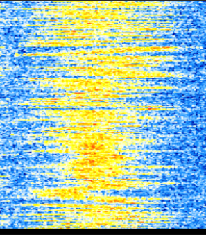|
|Morse (script SDR - hackRF)| 433 | 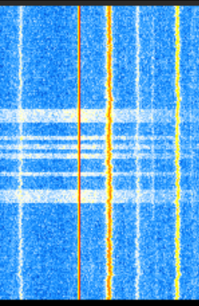|
|AM (aviation civile)| 121 | 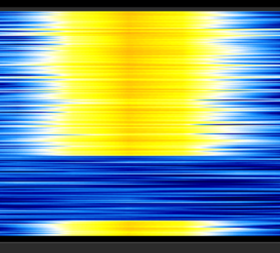|
|Cable HDMI (émission compromettante d'un écran déporté)| 148 | |
|Wifi (Boxe internet)| 2400 | 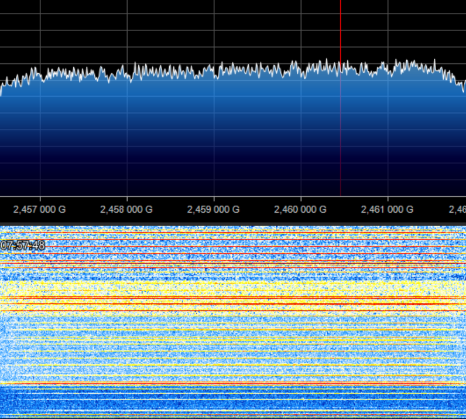|
|DECT (Babyphone Avent Philips - aussi utilisé pour des téléphones d'entreprise)| 1889 | 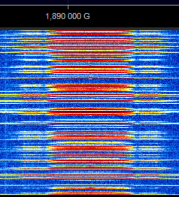|
|Bluetouth (5.0) Low Energy (écouteurs Google pixels buds et leur boitier) - norms proprietaire de Google Fast Pair (GFPS)| 2400 | 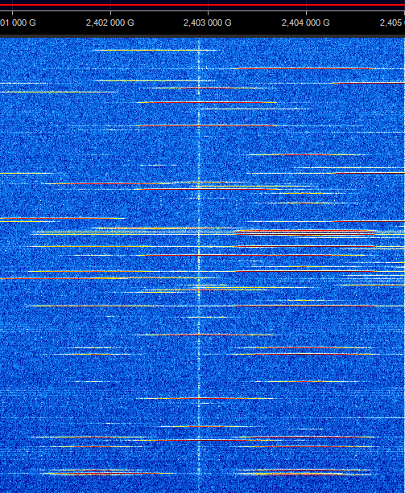|
|POCSAG (système de messagerie utilisé par les sapeurs-pompiers et des sociétés privées - échanges privés capturés près de Grenoble)| 466 | 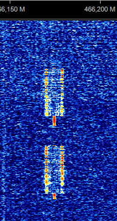|
|Télécommande portail (ouverture de résidence avec télécommande FERPORT TAC2KR)| 433 | 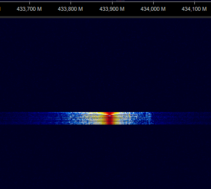|
|LoRa (Communication IoT non identifié)| 433 | 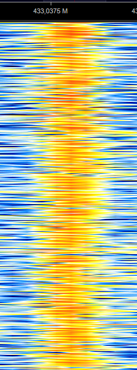 |
|Téléphonie - 4G LTE (bandes montante et descendante)| 800 |  |
|Drone - commandes + camera (DJI Tello)| 2442 | 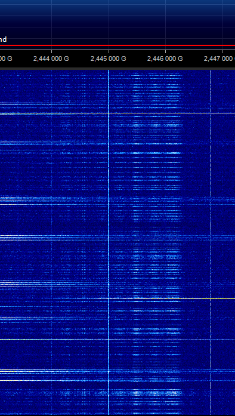 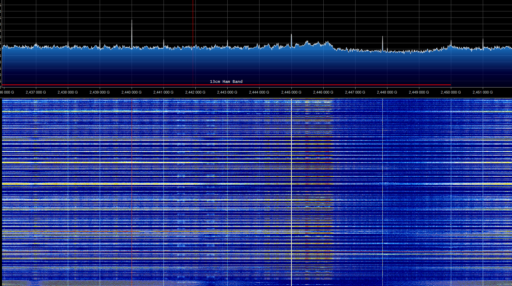 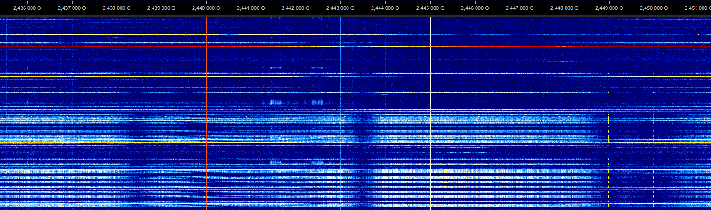 |
|NFC NXP - Mifare+ ISO 14443-4 (lecture de clé Yubikey avec l'application mobile yubico)| 13.550 |  |
|Télécommande de voiture téléguidée| 27 |  |

