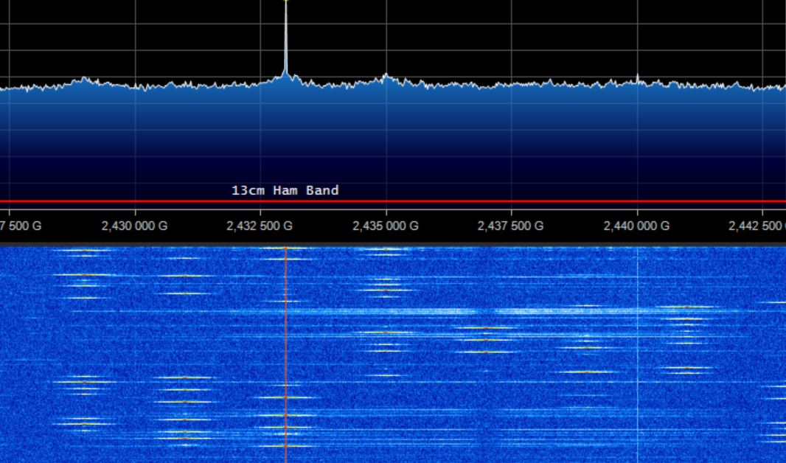

# indentification de signal SIGINT

## methode:

1. Capture

Every fruitful hunt starts from this first most important step! Try to gain as much information as possible: Frequency, Bandwidth, Mode, and so forth. Even the smallest detail could be decisive!

2. Inspection

Inspect the unknown signal with many useful tools: compare the waterfall, listen to an audio sample to discover similarities, or use the advanced filtering functions to reduce possible erroneous matches.

3. Identification

When only a few signal candidates remain on the top list, try to cross every piece of information you have in combination with the most detailed description readily available on sigidwiki.com... now should be easy to understand what you are looking for​.

Source: https://www.aresvalley.com/artemis/

## Manuellement

* Documentation `SDR#` avec captures d'écran

## via Base de données

### Internet

[sigidwiki](https://www.sigidwiki.com/wiki/Signal_Identification_Guide)

### Artemis

[Artemis.exe](https://www.aresvalley.com/artemis/)
[Artemis Github](https://github.com/AresValley/Artemis)

## automatisation via logiciels

[SigDigger](https://github.com/BatchDrake/SigDigger)

## Captures

| Id | Freq (Mhz) | Capture |
|:----:|----: |:---------:|
|FM (radio)| 107 | |
|Morse (script SDR - hackRF)| 433 | |
|AM (aviation civile)| 121 | |
|Cable HDMI (émission compromettante d'un écran déporté)| 148 | |
|Wifi (Boxe internet)| 2400 | |
|DECT (Babyphone Avent Philips - aussi utilisé pour des téléphones d'entreprise)| 1889 | |
|Bluetouth (5.0) Low Energy (écouteurs Google pixels buds et leur boitier) - norms proprietaire de Google Fast Pair (GFPS)| 2400 | |
|POCSAG (système de messagerie utilisé par les sapeurs-pompiers et des sociétés privées - échanges privés capturés près de Grenoble)| 466 | |
|Télécommande portail (ouverture de résidence avec télécommande FERPORT TAC2KR)| 433 | |
|LoRa (Communication IoT non identifié)| 433 |  |
|Téléphonie - 4G LTE (bandes montante et descendante)| 800 |  |
|Drone - commandes + camera (DJI Tello)| 2442 |    |
|NFC NXP - Mifare+ ISO 14443-4 (lecture de clé Yubikey avec l'application mobile yubico)| 13.550 |  |
|Télécommande de voiture téléguidée| 27 |  |
| Scan de détection Airtags (Detecteur de traqueur Apple pour Android) | 2400 |  |
| Airtag Advertising - (Apple Airtag) | 2400 |  |

