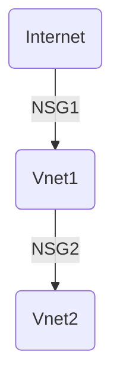

# Administration Azure

## Calucl des couts

[Calculator](https://azure.microsoft.com/fr-fr/pricing/calculator/)

> penser aux spending limits

## Users

[liste des rôles](https://learn.microsoft.com/en-us/azure/role-based-access-control/built-in-roles)

```powershell
# Créer un utilisateur
New-AzADUser -DisplayName "NouvelUtilisateur" -UserPrincipalName "nouvelutilisateur@domain.com" -Password "Redacted"

# Créer un groupe de ressources
New-AzResourceGroup -Name "ExempleGroupe" -Location "WestUS"

# Accorder les permissions
New-AzRoleAssignment -ObjectId (Get-AzADUser -UserPrincipalName "nouvelutilisateur@domain.com").Id -RoleDefinitionName "Contributor" -Scope "/subscriptions/IDDeVotreAbonnement/resourceGroups/ExempleGroupe"
```


## NSG:

NSGs use rules to allow or deny traffic moving through the network. 



* peut être attribué à un Subnet
* peut être attribué à une NIC (plus sûr)
* Les règles sont traitées par n° (comme un firewall), le plus faible est prioritaire

```powershell
Get-AzNetworkSecurityGroup | format-table Name, Location, ResourceGroupName, ProvisioningState, ResourceGuid
```

1. Une fois les `VM` créés, et `Networking` configuré, aller dans `Network Security Groups`

2. Créer et sélectionner le `ressourceGroup` de notre VM

3. Dans notre `NSG` sélectionner `Network Interface` et associer la `NIC` de notre VM

4. Dans `Virtual Machine` -> `Networking` -> `Add Inbound rule` et ajouter le port autorisé


## Créer une VM


```sh
az vm create \
--resource-group learn-f95b0f1e-6792-468f-bd1d-88a0391c03a3 \
--location westus \
--name SampleVM \
--image UbuntuLTS \
--admin-username azureuser \
--generate-ssh-keys \
--verbose 

az vm stop \
--name SampleVM \
--resource-group learn-f95b0f1e-6792-468f-bd1d-88a0391c03a3

az vm image list --output table
```


## Ouvrir un port


```sh
az vm open-port \
--port 80 \
--resource-group learn-f95b0f1e-6792-468f-bd1d-88a0391c03a3 \
--name SampleVM
```

## VM Sizing:

```sh
az vm list --output table

az vm list-ip-addresses -n SampleVM -o table

az vm show --resource-group learn-f95b0f1e-6792-468f-bd1d-88a0391c03a3 --name SampleVM

az vm list-sizes --location eastus --output table

az vm list-vm-resize-options \
--resource-group learn-f95b0f1e-6792-468f-bd1d-88a0391c03a3 \
--name SampleVM \
--output table

az vm resize \
--resource-group learn-f95b0f1e-6792-468f-bd1d-88a0391c03a3 \
--name SampleVM \
--size Standard_D2s_v3
```


## Create a resource group:

```powershell
$Location = "EastUS" 
New-AzResourceGroup -Name vm-networks -Location $Location
```

## Create a subnet and virtual network

```powershell
$Subnet= New-AzVirtualNetworkSubnetConfig -Name default -AddressPrefix 10.0.0.0/24
New-AzVirtualNetwork -Name myVnet -ResourceGroupName vm-networks -Location $Location -AddressPrefix 10.0.0.0/16 -Subnet $Subnet
```

### créer une VM et connaitre son IP publique:

```powershell
New-AzVm `
-ResourceGroupName "vm-networks" `
-Name "dataProcStage1" `
-VirtualNetworkName "myVnet" `
-SubnetName "default" `
-image "Win2016Datacenter" `
-Size "Standard_DS2_v2"

Get-AzPublicIpAddress -Name dataProcStage1
```

## désassocier l'IP publique:

```powershell
$nic = Get-AzNetworkInterface -Name dataProcStage2 -ResourceGroup vm-networks
$nic.IpConfigurations.publicipaddress.id = $null
Set-AzNetworkInterface -NetworkInterface $nic 
```

## Azure VPN Gateway:

Each virtual network can have only one VPN gateway

gateway type :

* Network-to-network connections over IPsec/IKE VPN tunneling, linking VPN gateways to other VPN gateways.

* Cross-premises IPsec/IKE VPN tunneling, for connecting on-premises networks to Azure through dedicated VPN devices to create site-to-site connections.

* Point-to-site connections over IKEv2 or SSTP, to link client computers to resources in Azure.


### VPN Workflow:

1. Design your connectivity topology, listing the address spaces for all connecting networks.

2. Create an Azure virtual network.

3. Create a VPN gateway for the virtual network.

4. Create and configure connections to on-premises networks or other virtual networks, as required.

5. If required, create and configure a point-to-site connection for your Azure VPN gateway.


### The type of VPN gateway 

** RouteBased** : 

* Route-based VPN devices use any-to-any (wildcard) traffic selectors, and let routing/forwarding tables direct traffic to different IPsec tunnels. 
* Route-based connections are typically built on **router platforms** where each IPsec tunnel is modeled as a network interface or VTI (virtual tunnel interface).

** PolicyBased** 

* Policy-based VPN devices use the combinations of prefixes from both networks to define how traffic is encrypted/decrypted through IPsec tunnels. 
* A policy-based connection is typically built on **firewall devices** that perform packet filtering. IPsec tunnel encryption and decryption are added to the packet filtering and processing engine.

### Set up a VPN gateway

1. Create a virtual network

2. Add a gateway subnet

3. Specify a DNS server (optional)

4. Create a virtual network gateway

5. Generate certificates

6. Add the client address pool

7. Configure the tunnel type

8. Configure the authentication type

9. Upload the root certificate public certificate data

10. Install an exported client certificate

11. Generate and install the VPN client configuration package

12. Connect to Azure


### ExpressRoute:

Avantages : 

* Faster speeds, from 50 Mbps to 10 Gbps, with dynamic bandwidth scaling

* Greater reliability through built-in peering


## Azure templates (IaC)

**Infra as code** : les ressources sont définies dans des fichiers `JSON`

* [quickStart Template Gallery](https://azure.microsoft.com/fr-fr/resources/templates/)

exemple de déploiement - validation puis création:
az deployment group validate \
--resource-group $RESOURCEGROUP \
--template-uri "https://raw.githubusercontent.com/Azure/azure-quickstart-templates/master/101-vm-simple-windows/azuredeploy.json" \
--parameters adminUsername=$USERNAME \
--parameters adminPassword=$PASSWORD \
--parameters dnsLabelPrefix=$DNS_LABEL_PREFIX

az deployment group create \
--name MyDeployment \
--resource-group $RESOURCEGROUP \
--template-uri "https://raw.githubusercontent.com/Azure/azure-quickstart-templates/master/101-vm-simple-windows/azuredeploy.json" \
--parameters adminUsername=$USERNAME \
--parameters adminPassword=$PASSWORD \
--parameters dnsLabelPrefix=$DNS_LABEL_PREFIX

avec un fichier json:

az deployment group create \
--name MyDeployment \
--resource-group $RESOURCEGROUP \
--template-file azuredeploy.json \
--parameters adminUsername=$USERNAME \
--parameters adminPassword=$PASSWORD \
--parameters dnsLabelPrefix=$DNS_LABEL_PREFIX


## Managed Disks:

Types of disks:

* OS disk: When you create an Azure VM, Azure automatically attaches a VHD for the operating system (OS).

* Temporary disk: When you create an Azure VM, Azure also automatically adds a temporary disk. This disk is used for data, such as page and swap files. The data on this disk may be lost during maintenance or a VM redeploy. Don't use it for storing permanent data, such as database files or transaction logs.

* Data disks: A data disk is a VHD that's attached to a virtual machine to store application data or other data you need to keep.

### VHD Files:

Azure Disks are designed for 99.999% availability.

| Storage account type | Services supported	Types of blobs supported |
|-----|----|
| General-purpose standard Azure Blob storage, Azure Files, Azure Queue storage	Block blobs, page blobs, and append blobs |
| General-purpose premium	Blob storage | Page blobs|
| Blob storage, hot and  Blob storage |	Block blobs and append blobs cool access tiers |

```powershell
# ajouter un disk vide:
az vm disk attach \
--vm-name support-web-vm01 \
--name uploadDataDisk1 \
--size-gb 64 \
--sku Premium_LRS \
--new

# initialize and format Disks:

az vm extension set \
--vm-name support-web-vm01 \
--name customScript \
--publisher Microsoft.Azure.Extensions \
--settings '{"fileUris":["https://raw.githubusercontent.com/MicrosoftDocs/mslearn-add-and-size-disks-in-azure-virtual-machines/master/add-data-disk.sh"]}' \
--protected-settings '{"commandToExecute": "./add-data-disk.sh"}'
```


## Azure disk encryption technologies

* Storage Service Encryption (SSE) - protect data at rest, azure managed disks, enabled by default: AES256
* Azure Disk Encryption (ADE) - managed by VM owner, OS level: Bitlocker | DM-crypt - required for VMs backed up to the Recovery Vault

## Azure Disk Encryption prerequisites

1. Create a key vault.
2. Set the key vault access policy to support disk encryption.
3. Use the key vault to store the encryption keys for ADE.

### créer key vault:

```powershell
New-AzKeyVault -Location <location> `
-ResourceGroupName <resource-group> `
-VaultName "myKeyVault" `
-EnabledForDiskEncryption

az keyvault create \
--name "myKeyVault" \
--resource-group <resource-group> \
--location <location> \
--enabled-for-disk-encryption True 
```

GUI: home -> create ressource -> Key Vault


### Enabling access policy:

There are three policies you can enable.

* Disk encryption - Required for Azure Disk encryption.
* Deployment - (Optional) Enables the Microsoft.Compute resource provider to retrieve secrets from this key vault when this key vault is referenced in resource creation, for example when creating a virtual machine.
* Template deployment - (Optional) Enables Azure Resource Manager to get secrets from this key vault when this key vault is referenced in a template deployment.

```powershell
Set-AzKeyVaultAccessPolicy -VaultName <keyvault-name> -ResourceGroupName <resource-group> -EnabledForDiskEncryption

az keyvault update --name <keyvault-name> --resource-group <resource-group> --enabled-for-disk-encryption "true"
```

### Encrypt Disk:

```powershell
Set-AzVmDiskEncryptionExtension `
	-ResourceGroupName <resource-group> `
-VMName <vm-name> `
-VolumeType [All | OS | Data]
	-DiskEncryptionKeyVaultId <keyVault.ResourceId> `
	-DiskEncryptionKeyVaultUrl <keyVault.VaultUri> `
 -SkipVmBackup

az vm encryption enable \
--resource-group <resource-group> \
--name <vm-name> \
--disk-encryption-keyvault <keyvault-name> \
--volume-type [all | os | data] \
```

### disks Encryption status:

```powershell
Get-AzVmDiskEncryptionStatus  -ResourceGroupName <resource-group> -VMName <vm-name>

az vm encryption show --resource-group <resource-group> --name <vm-name>
```
