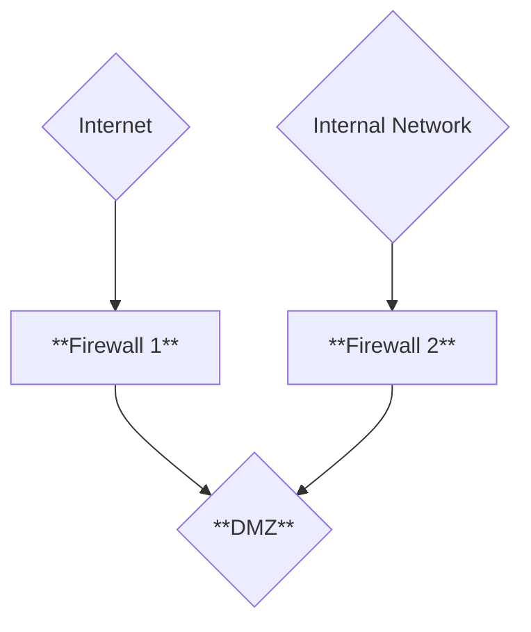
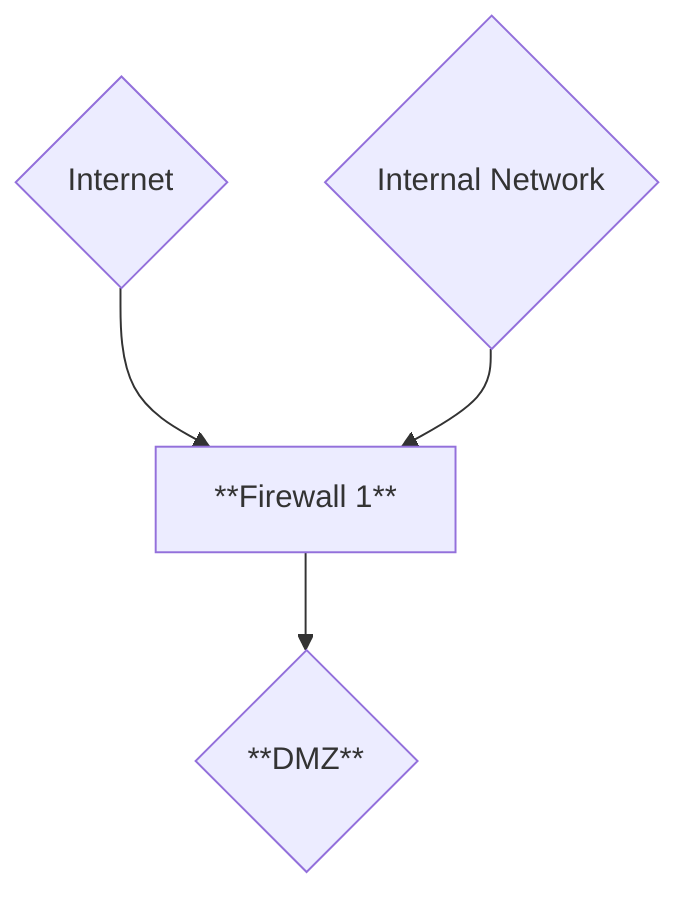
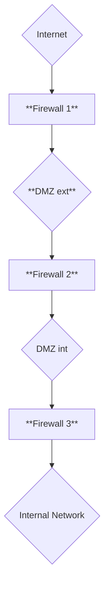

# Les Zone démilitarisées (DMZ)

Zone isolée fournissant des services à l'extérieur (Internet / *non-trusté*) mais aussi susceptible de fournir des services aux réseaux locaux (de confiance).

## DMZ Classique :

## DMZ à 1 firewall :

## plusieurs DMZ avec plusieurs niveau de sécurité

> [!WARNING]  
> Lorsque le réseau interne peut communiquer avec une machine en DMZ sans passer par le firewall, ou lorsque le réseau interne et la DMZ sont sur le même hyperviseur, ce n'est **PAS une DMZ**.