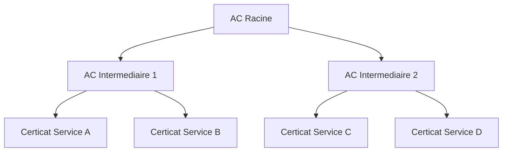

# PKI (Public key infrastructure) / IGC Infrastructure de gestion de clés

## Ressources

* [RGS](https://cyber.gouv.fr/le-referentiel-general-de-securite-version-20-les-documents)

* [Migration vers le Post-Quantique](https://cyber.gouv.fr/publications/avis-de-lanssi-sur-la-migration-vers-la-cryptographie-post-quantique-0)

## Definitions

* Autorité de certification (AC): Agit comme racine de confiance dans une infrastructure à clé publique et fournit des services qui authentifient l’identité des personnes, des ordinateurs et d’autres entités dans un réseau. (source: microsoft)

* Autorité d’inscription: Est certifié par une autorité de certification racine pour émettre des certificats pour des utilisations spécifiques autorisées par la racine. Dans une infrastructure à clé publique Microsoft, une autorité d’inscription (RA) est généralement appelée autorité de certification subordonnée. (source: microsoft)

* Base de données de certificats: Enregistre les demandes de certificat et les certificats émis et révoqués et les demandes de certificat sur l’autorité de certification ou l’autorité de certification. (source: microsoft)

* Magasin de certificats: Enregistre les certificats émis et les demandes de certificat en attente ou rejetées sur l’ordinateur local. (source: microsoft)

* Serveur d’archivage de clé : Enregistre les clés privées chiffrées dans la base de données de certificats pour une récupération après perte. (source: microsoft)

* Certificat Racine : En cryptographie et en sécurité informatique, un certificat racine est un certificat électronique non signé ou auto-signé qui identifie une autorité de certification (AC)

* Certificat Intermediaire : Le certificat intermédiaire est un certificat délivré en tant que couche intermédiaire entre l'autorité de certification et le certificat final de l'utilisateur. Il sert d'outil d'authentification pour indiquer à un navigateur qu'un certificat est à l'origine d'une source sûre et valide, le certificat racine de l'AC

* Chaine de confiance: Une chaîne de confiance garantit la sécurité, l'évolutivité et la conformité aux normes des autorités de certification. Il garantit également la confidentialité, la confiance et la sécurité pour ceux qui s'appuient sur des certificats d'entité finale, tels que les opérateurs de sites Web et les utilisateurs.

* HSM: Un Hardware Security Module ou HSM est un matériel électronique offrant un service de sécurité qui consiste à générer, stocker et protéger des clefs cryptographiques.

* CSR: Certificate Signing Request, utilisée pour demander un certificat auprès d'une autorité de certification (CA). 

## Points à prendre en compte pour la sécurité

* La durée de validité des certificats et les algorithmes de chiffrements choisis.

* L’impact de la compromission d’une clé privée (cliente ou serveur) sur le reste de l’IGC et de fait le choix de l’autorité de certification ainsi que les méthodes de révocation en fonction du besoin.

* Le stockage et le cloisonnement des secrets.

* Le cas échéant, les protocoles d’enrôlement.

* Les erreurs d’implémentation ou de configuration.


## Revocation et vérification de validité

* CRL :Ceritifcate Revocation list

* OCSP : Online Certificate Status Protocol


## Emplacements des certificats

### Certstore Windows

mmc: certmgr.msc

```powershell
ls Cert:\CurrentUser\
ls Cert:\CurrentUser\My\* |fl
```

## lire un certificat depuis un fichier

```sh 
openssl x509 -in certificate.crt -text -noout
```

```powershell
Get-PfxCertificate .\cert.cer |fl *
```

## Exemple d'architecture PKI


                           
