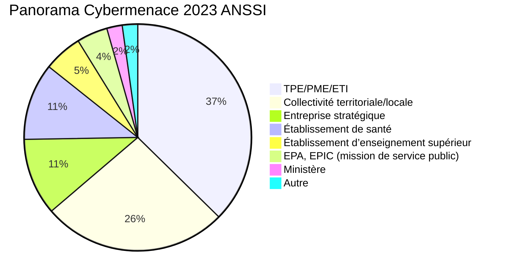

# Les fondamentaux de la cybersécurité (basics)

## Introduction

Les pertes mondiales imputables aux attaques informatiques dépassent les **1000 milliards/an** de dollars depuis 2020, ce qui représente plus de **1% du PIB mondial**

Depuis ce chiffre est en constante augmentation : ~*15%/an*

Les enjeux ne sont pas seulement financiers : les emplois, l’image et la stabilité de l’entreprise dépendent de la sécurité de ses actifs.



## Les attaques les plus courantes:

1. Usurpation d'identité
2. Vol de données
3. Chiffrement par ransomware
4. Deni de service
5. Infection par malware

(Source : CESIN,2022)


## Modes opératoires


## Les principaux vercteurs d'attaques

* **Mail** (ex: phishing)

* **Exploitation de vulnérabilité** (ex: application)

* **Site malveillant** (ex: lien vers un site compromis)

* **Accès à distance** (ex: RDP)

* **Accès physique** (ex: clé USB)

## Causes des cyberattaques


## Notions SSI

* **Système d’  Information (SI)** :  ensemble organisé de ressources (matériel, logiciels, personnel, données et procédures) permettant de traiter et de diffuser de l’information.

* **Sécurité d’un Système d’Information (SSI)** - ensemble des moyens techniques et non techniques de protection, permettant à un système d’information de résister à des événements susceptibles de compromettre la disponibilité, l’intégrité ou la confidentialité des données, traitées ou transmises et des services connexes que ces systèmes offrent ou rendent accessibles.

* **Actifs** (Assets) : tout ce qui a de la valeur au sein du SI


## La surface d'attaque

Tout ce que vous exposez à vos adversaires


## Les attaquants

### Les profils

* White Hat / Ethical Hacker : respecte le cadre légal (Pentest, Red Team, Bug Bounty, Divulgation responsable)

* Black Hat : intention de nuire ou de gagner de l'argent

* Grey Hat : Parfois éthique, parfois non...

* Script Kiddies : Peu de connaissance, mais utilisation d'outils "clé en main"


### (Moyens & compétences) Vs Ciblage


 ```mermaid
quadrantChart
    title Reach and engagement of campaigns
    x-axis Low Skills --> High Skills
    y-axis Low Targeting --> High Targeting
    quadrant-1 State Sponsored
    quadrant-2 Failed
    quadrant-3 Spam
    quadrant-4 Opportunistic
    Script Kiddies: [0.3, 0.6]
    Phishing: [0.45, 0.23]
    SpyWare: [0.85, 0.85]
    SpearPhishing: [0.70, 0.69]
    RansomWare: [0.78, 0.34]
    Scan: [0.20, 0.34]
```


### les motivations des attaquants

* **Gain** : monétisation des informations et/ou déni de service

* **Hacktivisme** : communication, idéologie

* **Concurrence** : nuire à ses adversaires

* **Intérêts étatiques et mercenariat** : espionnage et enjeux régaliens


## Les vulnérabilités

* **Def. Vulnérabilité** : Faute, par malveillance ou maladresse, dans les spécifications, la conception, la réalisation, l’installation ou la configuration d’un système, ou dans la façon de l’utiliser.

* **Remarques** : Une vulnérabilité peut être utilisée par un code d’exploitation et conduire à une intrusion dans le système. (faiblesse sur le SI)


### Identification et évaluation

* N° CVE : identifiant unique pour une vuln. [Nist NVD](https://nvd.nist.gov/)

* Alternative au NVD : [ENISA](https://euvd.enisa.europa.eu/) ou encore [VulDB](https://vuldb.com/fr/)

* Score CVSS : évaluation d'une vulnérabilité [First Calculator](https://www.first.org/cvss/)

* Reference CWE : mauvaise pratique [MITRE CWE](https://cwe.mitre.org/)

* Score EPSS : Exploit Prediction Scoring System [First EPSS](https://www.first.org/epss/user-guide)


### Pourquoi y a t-il autant de vulns ?

Ce qu’on veut faire faire :

```txt
« Pour aller à la gare : aller toujours tout droit, dès que vous voyez un panneau vert : tourner à droite et vous êtes arrivé »
```

Ce qu'on code : 

```python
def AllerGare():
    Arrivé = False
    while not Arrivé:
        ToutDroit()
        if Regarder() == 'vert':
            TournerDroite()
            Arrivé = True
    return 0
```

Ce que la machine execute :

```Assembly
ection .text
global _start
_start:
    ; while not Arrivé:
    jmp check

loop:
    ; ToutDroit()
    ; if Regarder() == 'vert':
    ; TournerDroite()
    ; Arrivé = True
    mov byte [Arrivé], 1

check:
    cmp byte [Arrivé], 0
    je loop

    ; return 0
    mov eax, 0x60
    xor edi, edi
    syscall
```


## Les Risques


* **Risque** = `Menace * Vulnérabilité * Impact`
* Evalusation du **risque** : `Impact * Vraissemblance` ou `Gravité * Facilité d'exploitation`


## Critères de sécurité (DICP)

* **Disponibilité** : ***que les données soient bien accessibles***

* **Intégrité** : Garantie que le système et l’information traitée ne sont modifiés que par une action volontaire et légitime. ***que les données n'ont pas été altérées ou modifiées***

* **Confidentialité** : Propriété d’une information qui n’est ni disponible, ni divulguée aux personnes, entités ou processus non autorisés. ***accessibles aux seules personnes autorisées***

* **Preuve**, Tracabililité, Non-répudiation

* **Authentitication** : L’authentification a pour but de vérifier l’identité dont une entité se réclame. ***La personne est bien celle qu'elle prétend être.***


## Le STRIDE (les menaces plutôt que les DICP)

* Spoofing (usurpation)

* Tampering (falsification)

* Répudiation (répudiation)

* Information Disclosure (fuite de données)

* Déni de service

* Élévation de privilèges

[source Microsoft](https://docs.microsoft.com/fr-fr/azure/security/develop/threat-modeling-tool-threats)


## Cadre juridique des systèmes de traitement automatisé de données (STAD)

### articles 323-1 et suivants du Code pénal

* Le fait d'accéder ou de se maintenir, frauduleusement, dans tout ou partie d'un système de traitement automatisé de données est puni de 3 ans d'emprisonnement et de 100 000 € d'amende.
* Lorsqu'il en est résulté soit la suppression ou la modification de données contenues dans le système, soit une altération du fonctionnement de ce système, la peine est de 5 ans d'emprisonnement et de 150 000 € d'amende.
* Lorsque les infractions prévues aux deux premiers alinéas ont été commises à l'encontre d'un système de traitement automatisé de données à caractère personnel mis en œuvre par l'Etat, la peine est portée à **7 ans d'emprisonnement et à 300 000 € d'amende**.


### Les émissions radio

* L' ANFR en application de l’article L.43 du Code des postes et communications électroniques (CPCE), veille à ce que les sites et les réseaux radioélectriques soient conformes à la réglementation et instruis les cas de brouillage qui lui sont signalés.

* Les utilisations de fréquences ou d’équipements radioélectriques en dehors des conditions réglementaires sont des délits soumis à une sanction pénale pouvant aller jusqu’à 6 mois de prison et 30 000 euros d’amende (L. 39-1 du CPCE).

* Les brouillages de fréquences autorisées causés par l’utilisation non conforme d’équipements radioélectriques, électriques ou électroniques sont des délits soumis à une sanction pénale pouvant aller jusqu’à 6 mois de prison et 30 000 euros d’amende (L. 39-1 du CPCE).

* En dehors de dérogations encadrées pour des services de l’État, la possession, l’utilisation, la cession à titre commercial ou gratuit, la publicité illicite de brouilleurs sont strictement interdites (article L. 33-3-1 du CPCE). Ce sont des délits soumis à une sanction pénale pouvant aller jusqu’à **6 mois de prison et 30 000 euros d’amende** (L. 39-1 du CPCE).


### Le RGPD

**données personnelles** : Une donnée personnelle est toute information se rapportant à une personne physique identifiée ou identifiable. ex:  Nom, numéro de téléphone ou de plaque d’immatriculation, un identifiant tel que le numéro de sécurité sociale, une adresse postale ou courriel, mais aussi la voix ou l’image. ou croisement de données: une femme vivant à telle adresse, née tel jour et membre dans telle association

Il est obligatoire de : 

    * Recueillir l'accord préalable des clients.

    * Informer les clients de leurs droits d'accès, de rectification, d'opposition et de suppression des informations collectées.

    * Veiller à la sécurité des systèmes d'information.

    * Assurer la confidentialité des données.

    * Indiquer une durée de conservation des données.


* le montant des sanctions pécuniaires peut s'élever jusqu'à **20 millions d'euros ou dans le cas d'une entreprise jusqu'à 4 % du chiffre d'affaires annuel mondial**


### Le cas du lanceur d'alerte

* Extrait de l'**Art. L. 2321-4 du code de la défense** : Pour les besoins de la sécurité des systèmes d’information, l’obligation prévue à l’article 40 du code de procédure pénale n’est pas applicable à l’égard d’une personne de bonne foi qui **transmet à la seule autorité nationale** de sécurité des systèmes d’information une information sur l’existence d’une vulnérabilité concernant la sécurité d’un système de traitement automatisé de données.


## Le cas des éditeurs de logiciels

* Extrait de l'**Art. L2321-4-1 du Code de la défense** : En cas de vulnérabilité significative affectant un de leurs produits ou en cas d'incident informatique compromettant la sécurité de leurs systèmes d'information et susceptible d'affecter significativement un de leurs produits, **les éditeurs de logiciels notifient à l'autorité nationale de sécurité des systèmes d'information** cette vulnérabilité ou cet incident ainsi que l'analyse de ses causes et de ses conséquences.


## Gouvernance

* PSSI : Politique SSI

* SMSI : Système de management de la Sécurité de l'information (ISO27001)

* SOC : Security operation center, utilise un SIEM pour la supervision de la sécurité.

* AdR : Analyse de risque


## Normes et cadre réglementaire

* LPM : Loi de programmation militaire, qui concerne les opérateurs d'importance vitale (OIV) et leurs Systèmes d'Information d'Importance Vitale (SIIV)

* NIS2 : Network Information Security, qui concerne les opérateurs de services essentiels (OSE) et leurs Systèmes d'Information Essentiels (SIE)

* RGPD : Données personnelles

* PCI : bancaire (payement)

* HDS : Données de Santé

* ISO2700X : normes SMSI

* RGS : Administration

* DORA : entités financières

* II901 : instruction interministérielle 901 (Diffusion Restreinte)


## L'isolatiion physique et la sécurité physique

La sécurité physique est la première couche de sécurité d’une entreprise, son but est de:

* Prévenir les accès non autorisés aux ressources et aux systèmes

* Empêcher l’altération et le vol des données sensibles

* Protéger de l’espionnage et du sabotage

* Limiter les attaques par ingénierie sociale


### Les risques liés à la sécurité physique

* Tailgating : suivre quelqu'un pour passer une porte

* PiggyBacking : demander l'ouverture d'une porte

* Shoulder Surfing : regarder le mot de passe d'un autre (par-dessus son épaule)

* Wiretapping : écoute via le réseau (logiciel ou matériel)

* Keylogger : enregistrement des frappes au clavier (logiciel ou matériel)

* Tempest : Compromissions par rayonnement electro magnétique


## Les mots de passe

> [!WARNING]  
>Toujours le principal point d'entrée pour l'attaquant

* Gestionnaire de mots de passe individuel pour les comptes personnels (ex: Keepass)

* Gestionnaire de mots de passe partagée pour les comptes de service

* Autant que possible on complète par du MFA

* Le minimum syndical : 12 chars avec maj, min, digit, spéciaux

* Avec les gestionnaires de mots de passe: 20 chars

* Comptes de services : +30 chars


## Les smartphones

Les problématiques spécifiques aux Smartphones

* Connecté simultanément à de multiples réseaux : 5G, Wifi, Bluetouth

* Droits donnés aux applications : l’appli lampe torche lit les messages...

* Toujours sur soi : pro et perso

* Backdoor Fabricant : micro activable légalement

* Pas toujours à jour: [Krack](https://fr.wikipedia.org/wiki/KRACK), [5Ghoul](https://asset-group.github.io/disclosures/5ghoul/)


## L'ingénierie sociale

### MICE

* Monnaie (Money)

* Idéologie

* Contrainte

* Ego (flatterie)

...Autres leviers :

* Urgence

* Sabotage


### Phishing

Phishing à partir de `https://www.securite-solutions.fr/login`, où est le piège ? 

```txt
https://www.securite-solutions.fr.it/login

https://www.securite-solutions.fr?p=<script>https://bidule.io?login</script>

https://www.securite-solutions/fr/login (plus de TLD, la machine utilisera les suffixes par défaut du bail DHCP)

https://www.securite-solution.fr/login (solution au singulier)

https://www.securite-solµtions.fr/login (« u » cyrillique)

https://www.securite-sоlution.fr/login (« o » cyrillique)
```


### Quelques matériels liés au hacking 

* [Great Scott Gadgets Throwing Star LAN Tap Kit ](https://www.amazon.fr/Great-Scott-Gadgets-Throwing-Star/dp/B07GYWZPXG)

* [Rubber Ducky](https://shop.hak5.org/products/usb-rubber-ducky)

* [HackRF](https://www.passion-radio.fr/emetteur-sdr/hackrf-sdr-75.html)

* [Flipper zero](https://flipperzero.one/)

* [Wifi PineApple](https://shop.hak5.org/products/wifi-pineapple)

* [OMG Cable](https://lab401.com/fr/products/o-mg-cable)


## Le "Zero Trust"

Politique permettant de vérifier (ou d'enforcer) avant l'accès aux ressources :

* Les Identités (utilisateurs)

* Les Devices (PC, Smartphone, Serveurs, IoT)

* Les Accès (IP, flux)

* Les Services (Conditions selon la requête utilisateur)

Exemple : NAC (Network Access Control)


## Référentiels et bonnes pratiques

* [ANSSI](https://cyber.gouv.fr/)

* [Guide d'hygiène](https://cyber.gouv.fr/publications/guide-dhygiene-informatique)


## Les réflexes en cas d'incidents

* Débrancher du réseau

* Ne pas éteindre

* Alerter le RSSI et N+1 par un autre canal

* [CERT-FR : les bons réflexes en cas d'incident](https://www.cert.ssi.gouv.fr/les-bons-reflexes-en-cas-dintrusion-sur-un-systeme-dinformation/)

* [ANSSI : Gestion de crise](https://cyber.gouv.fr/anticiper-et-gerer-une-crise-cyber)

* Voir aussi la partie Forensic du projet


## Pour aller plus loin 

* MESP d'initiation aux vulnérabilités

* [Autres README Dojo-101](https://github.com/Aif4thah/Dojo-101/)

* [Démonstration d'attaques](https://github.com/Aif4thah/VulnerableLightApp)

