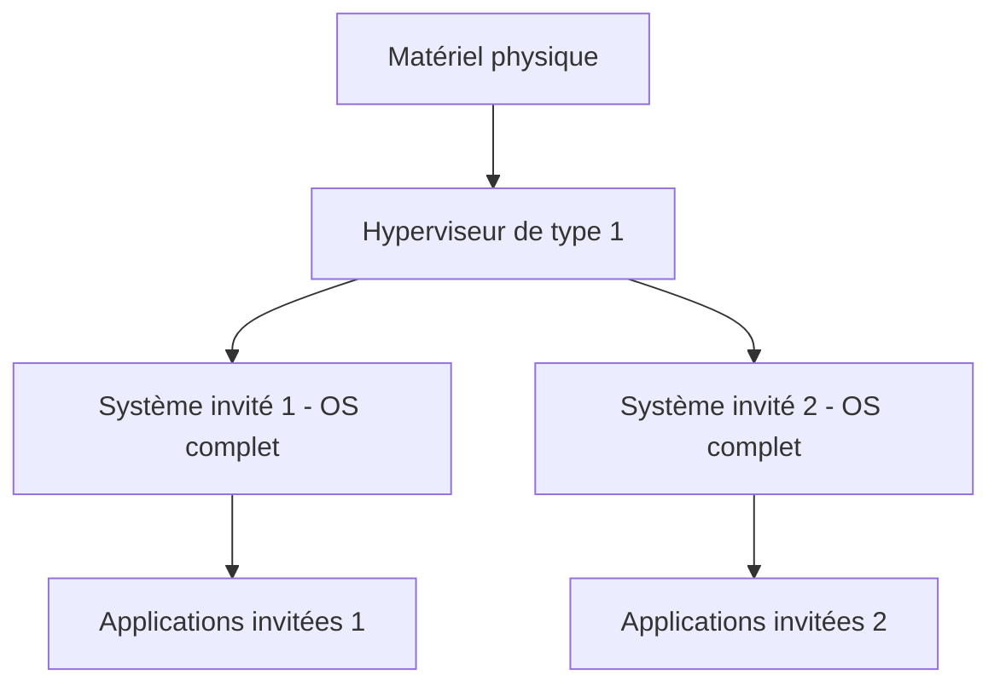
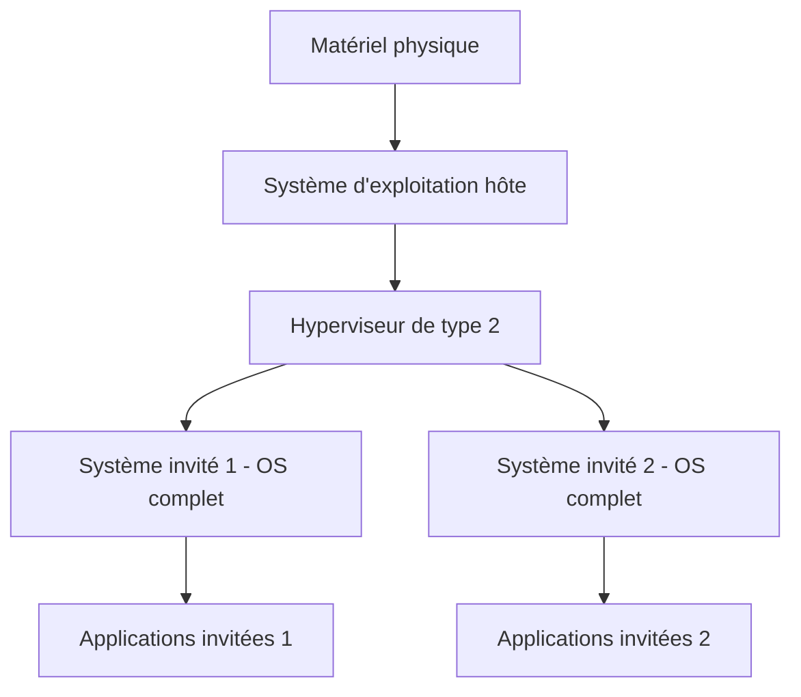

# Virtualization

## Ressources

* [Source ANSSI](https://cyber.gouv.fr/publications/securite-des-systemes-de-virtualisation)

## Types de virtualisation

| Type de virtualisation | Technique utilisée | Description | Exemples de solutions| Niveau de sécurité relatif    |
|-------|--------------------|----------------------|------------------|---------|
| Virtualisation applicative  | Émulation  | Imite une entité pour rendre les applis portables, indépendamment du matériel    | Citrix App Stream, App-V, Softgrid, JVM, .NET Framework| Faible à modéré  |
| Virtualisation applicative  | Cloisonnement   | Isole des environnements pour sécurité et gestion des ressources   | Linux Vserver, BSD jails, OpenVZ, Solaris Zones    | Modéré à élevé |
| Virtualisation système | Paravirtualisation | OS modifiés pour une interaction optimisée avec la couche d’abstraction | Xen, VMware ESX/ESXi, vSphere, Hyper-V, PolyXene   | Élevé |
| Virtualisation système | Virtualisation complète (totale)  | Exécute les OS sans modifications via traduction d’instructions ou exceptions| VMware Workstation, Virtual PC, VirtualBox, QEMU   | Modéré à élevé |
| Virtualisation système | Virtualisation assistée par le matériel  | Utilise du matériel dédié pour performances proches du natif sans modifier les OS | Intel VT-x/VT-d, AMD-V/IOMMU | Élevé    |

## Virtualisation système – Type 1 (bare-metal)

## Virtualisation système – Type 2 (hébergé)

### Les risques liés à la virtualisation

* Risque accru de compromission des systèmes

* Accroissement du risque d’indisponibilité

* Complexification de l’administration et de la mise en œuvre

* Complexification de la supervision
