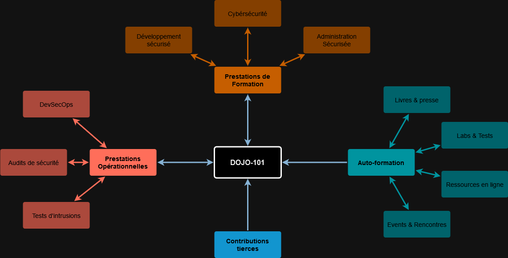

    

Dojo-101 est un projet de capitalisation d'expérience et de connaissances en cybersécurité.

Utilisable hors-ligne à l'aide d'un simple éditeur de texte, sa raison d'être est le partage gratuit de la connaissance.

### Langue :

> ⚠️ [Avant tout usage, merci de prendre connaissance de l'avis de non-responsabilité du projet](./CODE_OF_CONDUCT.md)

## 💡 Principe

## 👉 C'est parti !

Les fichiers README et ceux comportant le mot-clé `bascis` contiennent les éléments ensuite considérés comme des prérequis. Voici quelques suggestions :

* [Les bases de la cyber](https://github.com/Aif4thah/Dojo-101/blob/main/Dojo-101-SecOps/README.md)
* [les bases de Linux](https://github.com/Aif4thah/Dojo-101/blob/main/Dojo-101-SecOps/Linux-Basics.md)
* [les bases de powershell](https://github.com/Aif4thah/Dojo-101/blob/main/Dojo-101-SecOps/Powershell-basics.md)
* [les bases de python](https://github.com/Aif4thah/Dojo-101/blob/main/Dojo-101-DevSec/Python-basics.md)
* [les bases de la Radio](https://github.com/Aif4thah/Dojo-101/blob/main/Dojo-101-RF/RF-basics.md)
* [les bases de GitHub](https://github.com/Aif4thah/Dojo-101/blob/main/Dojo-101-DevSec/Github-basics.md)
* [les bases de IA](https://github.com/Aif4thah/Dojo-101/blob/main/Dojo-101-DevSec/IA-ML-basics.md)

## ⚔️ Thématiques

* [Développement sécurisé](https://github.com/Aif4thah/Dojo-101/tree/main/Dojo-101-DevSec)
* [Administration sécurisée](https://github.com/Aif4thah/Dojo-101/tree/main/Dojo-101-SecOps)
* [Pentest](https://github.com/Aif4thah/Dojo-101/tree/main/Dojo-101-Pentest)
* [Forensic](https://github.com/Aif4thah/Dojo-101/tree/main/Dojo-101-Forensic)
* [Radiofréquences](https://github.com/Aif4thah/Dojo-101/tree/main/Dojo-101-RF)

## ⬇️ Installation

0.  Si vous êtes sous Windows (client) et n'avez pas git d'installé : `winget install git.git `
1. `git clone https://github.com/Aif4thah/Dojo-101.git` 
2. Le contenu est mis à jour régulièrement, pensez à faire un `git pull` avant de l'utiliser.

## 📖 Usage

Ce projet est fait pour ne dépendre d'**aucun logiciels tiers**, votre éditeur de texte ou de code suffit pour rechercher lire et modifier les notes.

À titre d'exemple, on peut ouvrir le répertoire `DOJO-101` avec [VSCodium](https://github.com/VSCodium/vscodium) pour :

* Rechercher par mot-clé dans l'ensemble des fichiers (ex: `basics`, `Windows`, `Linux`)
* Lire le contenu au format `HTML` (`ctrl`+`shift` +`V`)

    

## 🤝 Contributions

* [Recommandations pour les contributeurs](./CONTRIBUTING)

## 🚨 Sécurité

* [À propos de la sécurité du projet](./SECURITY.md)

## 🌱 Apprentissage

* [Mises en situations professionnelles](https://github.com/Aif4thah/Dojo-101/tree/main/Dojo-101-Apprentissage)

## 🧪 Tester ses compétences

Développée en parallèle, cette application contient de nombreuses vulnérabilités pour tester vos connaissances :

* [VulnerableLightApp](https://github.com/Aif4thah/VulnerableLightApp)

## 🏆 Crédits

* Projet maintenu par [Michael Vacarella](https://github.com/Aif4thah)
* Logo réalisé par [@designbyzen](https://www.designbyzen.fr/)
* **Merci** à tous les contributeurs 😍
