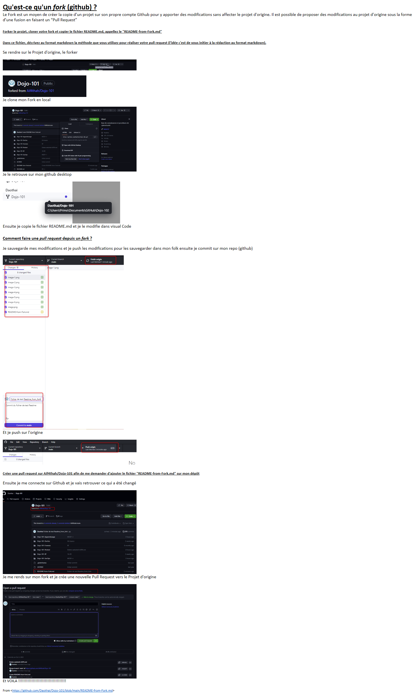

# Qu'est-ce qu'un *fork* (github) ?

Le Fork est un moyen de créer la copie d’un projet sur son propre compte Github
pour y apporter des modifications sans affecter le projet d'origine. Il est possible de proposer des modifications au projet d’origine sous la forme d’une fusion en faisant un “Pull Request”
## Forker le projet, cloner votre fork et copier le fichier README.md, appellez le "README-from-Fork.md"
### Dans ce fichier, décrivez au format markdown la méthode que vous utilisez pour réaliser votre pull request (l'idée c'est de vous initier à la rédaction au format markdown).
 Se rendre sur le Projet d'origine, le forker 

 

 

 Je clone mon Fork en local 

 

 Je le retrouve sur mon github desktop

 

 Ensuite je copie le fichier README.md et je le modifie dans visual Code 

#### Comment faire une *pull request* depuis un *fork* ?

 Je sauvegarde mes modifications et je push les modifications pour les sauvegarder dans mon folk ensuite je commit sur mon repo (github)  

Et je push sur l'origine

##### Créer une pull request sur Aif4thah/Dojo-101 afin de me demander d'ajouter le fichier "README-from-Fork.md" sur mon dépôt

Ensuite je me connecte sur Github et je vais retrouver ce qui a été changé 

Je me rends sur mon fork et je crée une nouvelle Pull Request vers le Projet d'origine

Et VOILA !!!!!!!!!!!!!!!!!!!!!!!!!!!!!!!!!!!!