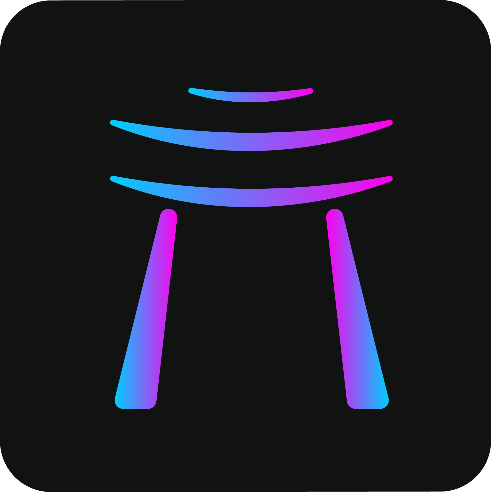
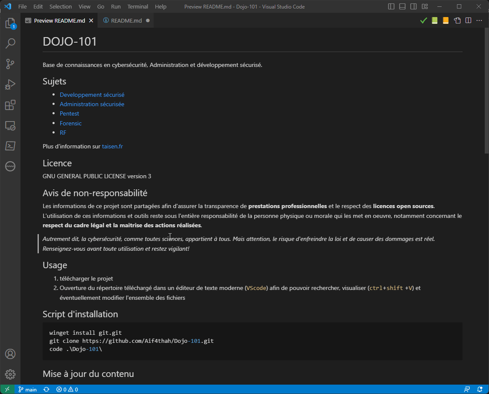

<p align="center">
    
</p>

[](https://www.gnu.org/licenses/gpl-3.0)
[](https://github.com/Aif4thah/Dojo-101/pulls)
[](https://etherscan.io/address/0xcC424e30Ff6eEAb4E6B3A900c5446038F858b314)
[](https://www.buymeacoffee.com/taisensolutions)

Dojo-101 est un projet de capitalisation d'expérience en cybersécurité.
Minimaliste, utilisable hors-ligne et en français, ce projet est ouvert à tous. 
Il est fait pour être téléchargé et utilisé localement avec votre éditeur de texte préféré.

## Contact

Si vous avez des questions sur ce projet ou mes services, n'hésitez pas à me contacter :

 [](https://taisen.fr)
 [](https://www.linkedin.com/in/mvacarella/)
 [](mailto:michael.vacarella@protonmail.com)

## Éthique et avis de non-responsabilité

* [À lire avant tout usage](./CODE_OF_CONDUCT.md)

## Thématiques

* [Développement sécurisé](https://github.com/Aif4thah/Dojo-101/tree/main/Dojo-101-DevSec)
* [Administration sécurisée](https://github.com/Aif4thah/Dojo-101/tree/main/Dojo-101-SecOps)
* [Pentest](https://github.com/Aif4thah/Dojo-101/tree/main/Dojo-101-Pentest)
* [Forensic](https://github.com/Aif4thah/Dojo-101/tree/main/Dojo-101-Forensic)
* [Radiofréquences](https://github.com/Aif4thah/Dojo-101/tree/main/Dojo-101-RF)

## Usage

1. Télécharger le projet
2. Ouverture du répertoire entier dans un éditeur de texte moderne (ex: `VScode`)
3. Rechercher par mots clé dans l'ensemble des fichiers (ex: `basics`, `windows`, `linux`)
4. Visualiser le contenu au format html (`ctrl`+`shift` +`V`)



## Installation

```powershell
winget install git.git
git clone https://github.com/Aif4thah/Dojo-101.git
code .\Dojo-101\
```

## Mise à jour

* Le contenu est mis à jour régulièrement, pensez à faire un `git pull` avant de l'utiliser.

## Contributions

* [Recommandations pour les contributeurs](./CONTRIBUTING)

## Sécurité

* [À propos de la sécurité du projet](./SECURITY.md)

## Crédits

 * Logo réalisé par [@designbyzen](https://www.designbyzen.fr/)


