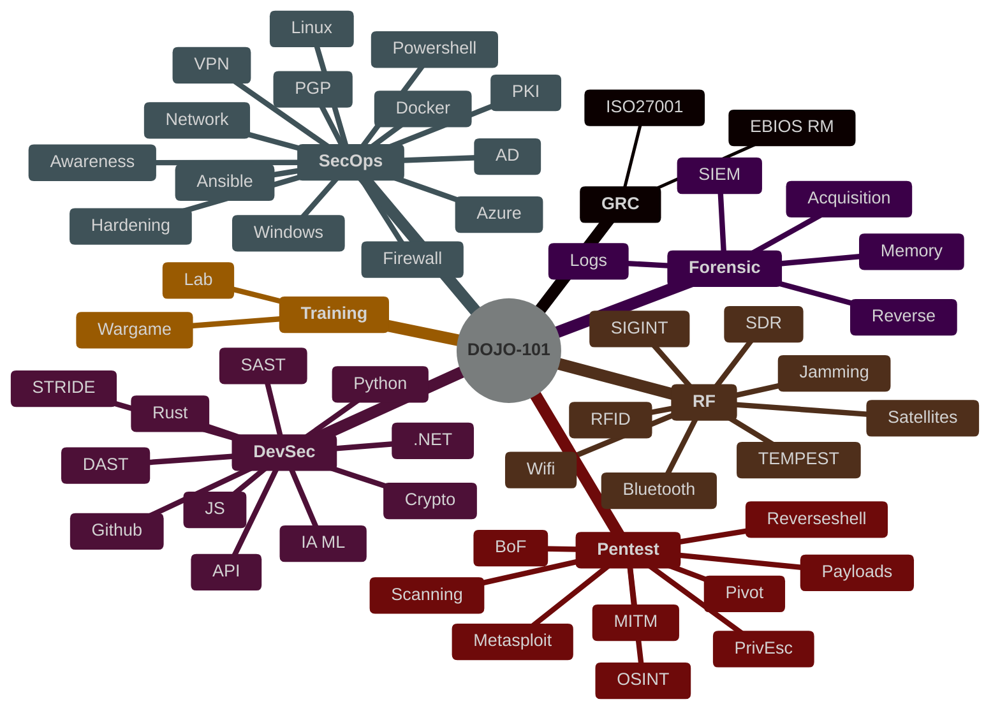

# Dojo-101

<p align="center">
    
    <br>DOJO-101 : Offline Cybersecurity Knowledge Base
</p>

[](https://www.gnu.org/licenses/gpl-3.0)
[](https://github.com/Aif4thah/Dojo-101/pulls)


[](https://github.com/sponsors/Aif4thah/)

> [!WARNING]
> This repository and its tools are provided "as is" without warranty of any kind, either express or implied, including but not limited to, any warranties of merchantability, fitness for a particular purpose, and non-infringement. The authors shall not be liable for any claims, damages, or other liabilities arising from, out of, or in connection with the use of this tool. The user is solely responsible for ensuring their use of this tool complies with all applicable laws and regulations. The authors disclaim any liability for illegal or unethical use.

## ⚔️ Themes

* [Secure development](https://github.com/Aif4thah/Dojo-101/tree/main/Dojo-101-DevSec)
* [Secure administration](https://github.com/Aif4thah/Dojo-101/tree/main/Dojo-101-SecOps)
* [Pentest](https://github.com/Aif4thah/Dojo-101/tree/main/Dojo-101-Pentest)
* [Forensic](https://github.com/Aif4thah/Dojo-101/tree/main/Dojo-101-Forensic)
* [Radio frequencies](https://github.com/Aif4thah/Dojo-101/tree/main/Dojo-101-RF)
* [Governance, Risk and Compliance](https://github.com/Aif4thah/Dojo-101/tree/main/Dojo-101-Governance)



## 👉 Let’s get started

README Files and those containing the keyword `basics` contain elements that are subsequently considered prerequisites. Here are some suggestions:

* [Cyber basics (french)](https://github.com/Aif4thah/Dojo-101/blob/main/Dojo-101-SecOps/README.md)
* [Linux basics](https://github.com/Aif4thah/Dojo-101/blob/main/Dojo-101-SecOps/Linux-Basics.md)
* [Powershell basics](https://github.com/Aif4thah/Dojo-101/blob/main/Dojo-101-SecOps/Powershell-basics.md)
* [Python basics](https://github.com/Aif4thah/Dojo-101/blob/main/Dojo-101-DevSec/Python-basics.md)
* [Wifi basics](https://github.com/Aif4thah/Dojo-101/blob/main/Dojo-101-RF/Wifi-basics.md)
* [GitHub basics](https://github.com/Aif4thah/Dojo-101/blob/main/Dojo-101-DevSec/Github-basics.md)
* [AI Basics](https://github.com/Aif4thah/Dojo-101/blob/main/Dojo-101-DevSec/IA-ML-basics.md)

> Some sections are still in French. The translation will be completed according to the needs of sponsors and customers.

## 📒 You need almost nothing

Clone the repository without the history using the following command:

```sh
git clone --depth 1 https://github.com/Aif4thah/Dojo-101
```

Open `DOJO-101` folder with [VSCode](https://code.visualstudio.com/) then,

* Search by keyword across all files (e.g., `basics`, `Windows`, `Linux`)
* Read the content in `HTML` format (`ctrl`+`shift` +`V`)

## 🤝 Contributions

* [Contributor guidelines](https://github.com/Aif4thah/Dojo-101/blob/main/CONTRIBUTING.md)

## 🚨 Security

* [About project security](https://github.com/Aif4thah/Dojo-101/blob/main/SECURITY.md)

## 🌱 Learning

* [Professional scenarios](https://github.com/Aif4thah/Dojo-101/tree/main/Dojo-101-Apprentissage)

## 🧪 Test your skills

Developed in parallel, this application contains numerous vulnerabilities for testing your knowledge :

* [VulnerableLightApp](https://github.com/Aif4thah/VulnerableLightApp)

## 🏆 Credits

* **Thank you** to all contributors 😍

* Logo created by [@designbyzen](https://www.designbyzen.fr/)

* Project maintained by [Michael Vacarella](https://github.com/Aif4thah)

* Support this effort and give back by [sponsoring on GitHub!](https://github.com/sponsors/Aif4thah/)
