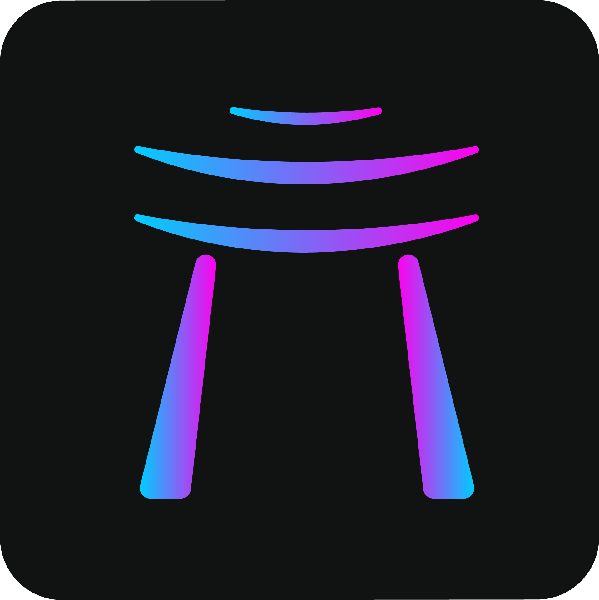
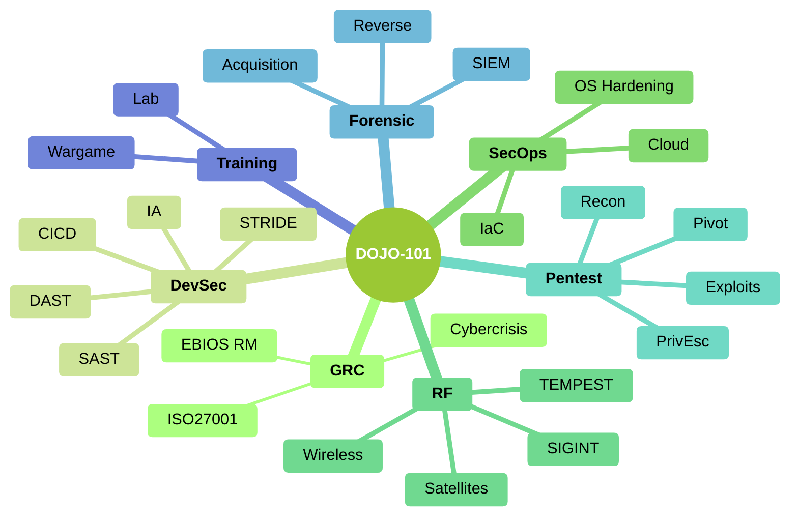

# Dojo-101

<p align="center">
    
    <br>DOJO-101 : Offline Cybersecurity Knowledge Base
</p>

[](https://www.gnu.org/licenses/gpl-3.0)
[](https://github.com/Aif4thah/Dojo-101/pulls)


[](https://github.com/sponsors/Aif4thah/)

> [!WARNING]
> This repository and its tools are provided "as is" without warranty of any kind, either express or implied, including but not limited to, any warranties of merchantability, fitness for a particular purpose, and non-infringement. The authors shall not be liable for any claims, damages, or other liabilities arising from, out of, or in connection with the use of this tool. The user is solely responsible for ensuring their use of this tool complies with all applicable laws and regulations. The authors disclaim any liability for illegal or unethical use.

## ⚔️ Themes

* [Secure development](https://github.com/Aif4thah/Dojo-101/tree/main/Dojo-101-DevSec)
* [Secure administration](https://github.com/Aif4thah/Dojo-101/tree/main/Dojo-101-SecOps)
* [Pentest](https://github.com/Aif4thah/Dojo-101/tree/main/Dojo-101-Pentest)
* [Forensic](https://github.com/Aif4thah/Dojo-101/tree/main/Dojo-101-Forensic)
* [Radio frequencies](https://github.com/Aif4thah/Dojo-101/tree/main/Dojo-101-RF)
* [Governance](https://github.com/Aif4thah/Dojo-101/tree/main/Dojo-101-Governance)


```mermaid
%%{ init: { "theme": "forest" } }%%
mindmap
  root((**DOJO-101**))

      **GRC**
        ISO27001
        EBIOS RM
        Cybercrisis
    
    **DevSec**
        SAST
        DAST
        STRIDE
        CICD
        IA

    **SecOps**
        OS Hardening
        IaC
        Cloud

    **RF**
        TEMPEST
        SIGINT
        Wireless
        Satellites

    **Pentest**
        Recon
        Exploits
        PrivEsc
        Pivot

    **Forensic**
        Acquisition
        Reverse
        SIEM

    **Training**
        Lab
        Wargame

```

## 👉 Let’s get started

README Files and those containing the keyword `basics` contain elements that are subsequently considered prerequisites. Here are some suggestions:

* [Cyber basics (french)](https://github.com/Aif4thah/Dojo-101/blob/main/Dojo-101-SecOps/README.md)
* [Linux basics](https://github.com/Aif4thah/Dojo-101/blob/main/Dojo-101-SecOps/Linux-Basics.md)
* [Powershell basics](https://github.com/Aif4thah/Dojo-101/blob/main/Dojo-101-SecOps/Powershell-basics.md)
* [Python basics](https://github.com/Aif4thah/Dojo-101/blob/main/Dojo-101-DevSec/Python-basics.md)
* [Wifi basics](https://github.com/Aif4thah/Dojo-101/blob/main/Dojo-101-RF/Wifi-basics.md)
* [GitHub basics](https://github.com/Aif4thah/Dojo-101/blob/main/Dojo-101-DevSec/Github-basics.md)
* [AI Basics](https://github.com/Aif4thah/Dojo-101/blob/main/Dojo-101-DevSec/IA-ML-basics.md)

> Some sections are still in French. The translation will be completed according to the needs of sponsors and customers.

## 📒 You need almost nothing

Clone the repository without the history using the following command:

```sh
git clone --depth 1 https://github.com/Aif4thah/Dojo-101
```

Open `DOJO-101` folder with [VSCode](https://code.visualstudio.com/) then,

* Search by keyword across all files (e.g., `basics`, `Windows`, `Linux`)
* Read the content in `HTML` format (`ctrl`+`shift` +`V`)

## 🤝 Contributions

* [Contributor guidelines](https://github.com/Aif4thah/Dojo-101/blob/main/CONTRIBUTING.md)

## 🚨 Security

* [About project security](https://github.com/Aif4thah/Dojo-101/blob/main/SECURITY.md)

## 🌱 Learning

* [Professional scenarios](https://github.com/Aif4thah/Dojo-101/tree/main/Dojo-101-Apprentissage)

## 🧪 Test your skills

Developed in parallel, this application contains numerous vulnerabilities for testing your knowledge :

* [VulnerableLightApp](https://github.com/Aif4thah/VulnerableLightApp)

## 🏆 Credits

* **Thank you** to all contributors 😍

* Logo created by [@designbyzen](https://www.designbyzen.fr/)

* Project maintained by [Michael Vacarella](https://github.com/Aif4thah)

* Support this effort and give back by [sponsoring on GitHub!](https://github.com/sponsors/Aif4thah/)


## 🌐 Web Resources & Aesthetic Symbols Index
- [SYM 1F63F](https://coquette-heart-text-40.pages.dev/symbol/sym-1f63f/)
- [ROBLOX NAMES](https://glitch-mecha-kaomoji-69.pages.dev/ru/roblox-names/)
- [SYM 2748](https://coquette-aesthetic-symbols-14.pages.dev/symbol/sym-2748/)
- [SYM 1F628](https://raven-gothic-kaomoji-25.pages.dev/symbol/sym-1f628/)
- [SYM 1D432](https://angelic-bio-symbols-59.pages.dev/symbol/sym-1d432/)
- [SYM 1D430](https://angelic-ribbon-text-78.pages.dev/symbol/sym-1d430/)
- [SYM 26A3](https://monochrome-text-lab-86.pages.dev/symbol/sym-26a3/)
- [SYM 26D6](https://witchy-runic-text-71.pages.dev/symbol/sym-26d6/)
- [JA](https://gothic-bio-fonts-81.pages.dev/ja/)
- [SYM 2627](https://fairy-lace-symbols-92.pages.dev/symbol/sym-2627/)
- [SYM 2626](https://anime-sparkle-text-81.pages.dev/symbol/sym-2626/)
- [STARRY LOVE AURA](https://anime-sparkle-text-23.pages.dev/symbol/starry-love-aura/)
- [CLOCKWISE OPEN CIRCLE ARROW](https://cyber-clan-tags-90.pages.dev/symbol/clockwise-open-circle-arrow/)
- [SYM 1D40C](https://minimal-star-symbols-43.pages.dev/symbol/sym-1d40c/)
- [SYM 26F8](https://sleek-line-unicode-29.pages.dev/symbol/sym-26f8/)
- [SYM 1F4A9](https://scholarly-cross-symbols-35.pages.dev/symbol/sym-1f4a9/)
- [SYM 1D483](https://chibi-emoticon-lab-65.pages.dev/symbol/sym-1d483/)
- [SYM 1F609](https://scholarly-cross-symbols-35.pages.dev/symbol/sym-1f609/)
- [VIRGO ZODIAC MAIDEN](https://scholarly-cross-symbols-35.pages.dev/symbol/virgo-zodiac-maiden/)
- [SYM 1F47D](https://anime-sparkle-text-81.pages.dev/symbol/sym-1f47d/)
- [SYM 26A6](https://minimal-star-symbols-43.pages.dev/symbol/sym-26a6/)
- [SYM 26FA](https://scholarly-cross-symbols-35.pages.dev/symbol/sym-26fa/)
- [TIKTOK CAPTIONS](https://vintage-angel-text-38.pages.dev/es/tiktok-captions/)
- [SYM 263A](https://alchemical-symbol-hub-52.pages.dev/symbol/sym-263a/)
- [BRACKETS](https://minimal-star-symbols-43.pages.dev/vi/brackets/)
- [SYM 26FA](https://mecha-gamer-fonts-53.pages.dev/symbol/sym-26fa/)
- [SYM 1D490](https://pearl-heart-symbols-95.pages.dev/symbol/sym-1d490/)
- [BORDERS DIVIDERS](https://minimal-star-symbols-43.pages.dev/borders-dividers/)
- [SYM 1D483](https://raven-gothic-kaomoji-25.pages.dev/symbol/sym-1d483/)
- [VIRGO ZODIAC MAIDEN](https://neon-futuristic-symbols-58.pages.dev/symbol/virgo-zodiac-maiden/)
- [SYM 265B](https://kawaii-kaomoji-hub-96.pages.dev/symbol/sym-265b/)
- [SYM 1F61A](https://ribbon-bow-unicode-18.pages.dev/symbol/sym-1f61a/)
- [SYM 1D441](https://vintage-coquette-text-58.pages.dev/symbol/sym-1d441/)
- [NATURE FLOWERS](https://alchemist-symbol-hub-29.pages.dev/ru/nature-flowers/)
- [SYM 1D44C](https://kawaii-kaomoji-hub-96.pages.dev/symbol/sym-1d44c/)
- [SYM 1F631](https://vintage-angel-text-38.pages.dev/symbol/sym-1f631/)
- [SYM 1D481](https://sleek-line-unicode-29.pages.dev/symbol/sym-1d481/)
- [SYM 2659](https://scholarly-runes-text-68.pages.dev/symbol/sym-2659/)
- [ES](https://pearl-heart-symbols-95.pages.dev/es/)
- [SYM 1D43E](https://alchemist-symbol-hub-29.pages.dev/symbol/sym-1d43e/)
- [SYM 2621](https://anime-sparkle-text-81.pages.dev/symbol/sym-2621/)
- [SYM 1D44B](https://anime-sparkle-text-23.pages.dev/symbol/sym-1d44b/)
- [SYM 1F617](https://scholarly-cross-symbols-35.pages.dev/symbol/sym-1f617/)
- [SYM 1F619](https://alchemist-symbol-hub-29.pages.dev/symbol/sym-1f619/)
- [ROBLOX NAMES](https://anime-sparkle-text-81.pages.dev/pt/roblox-names/)
- [SYM 1F60B](https://dark-literary-kaomoji-13.pages.dev/symbol/sym-1f60b/)
- [SYM 1D477](https://kawaii-kaomoji-hub-96.pages.dev/symbol/sym-1d477/)
- [SYM 26B4](https://sleek-line-unicode-29.pages.dev/symbol/sym-26b4/)
- [SYM 26FE](https://occult-aesthetic-symbols-26.pages.dev/symbol/sym-26fe/)
- [SYM 26FA](https://kawaii-kaomoji-hub-80.pages.dev/symbol/sym-26fa/)
- [SYM 26EC](https://scholarly-runes-text-68.pages.dev/symbol/sym-26ec/)
- [OPEN CENTRE STAR](https://anime-sparkle-text-73.pages.dev/symbol/open-centre-star/)
- [SYM 1F638](https://alchemist-symbol-hub-29.pages.dev/symbol/sym-1f638/)
- [SYM 2633](https://ribbon-bow-unicode-18.pages.dev/symbol/sym-2633/)
- [SYM 1F633](https://pearl-heart-symbols-95.pages.dev/symbol/sym-1f633/)
- [CANCER ZODIAC CRAB](https://zen-unicode-hub-94.pages.dev/symbol/cancer-zodiac-crab/)
- [SYM 267E](https://synthwave-text-vault-95.pages.dev/symbol/sym-267e/)
- [HIGH VOLTAGE LIGHTNING](https://kawaii-kaomoji-hub-80.pages.dev/symbol/high-voltage-lightning/)
- [SYM 1F913](https://zen-aesthetic-fonts-87.pages.dev/symbol/sym-1f913/)
- [SYM 26C8](https://scholarly-cross-symbols-35.pages.dev/symbol/sym-26c8/)
- [SYM 26D4](https://anime-sparkle-text-22.pages.dev/symbol/sym-26d4/)
- [SYM 1F92A](https://zen-aesthetic-fonts-87.pages.dev/symbol/sym-1f92a/)
- [SYM 263F](https://synthwave-text-vault-95.pages.dev/symbol/sym-263f/)
- [SYM 267E](https://pearl-heart-symbols-95.pages.dev/symbol/sym-267e/)
- [BRACKETS](https://ribbon-bow-unicode-18.pages.dev/ja/brackets/)
- [SYM 26FB](https://scholarly-cross-symbols-35.pages.dev/symbol/sym-26fb/)
- [SYM 1D44E](https://kawaii-kaomoji-hub-96.pages.dev/symbol/sym-1d44e/)
- [SYM 1D420](https://kawaii-kaomoji-hub-96.pages.dev/symbol/sym-1d420/)
- [OUTLINED STAR](https://kawaii-kaomoji-hub-93.pages.dev/symbol/outlined-star/)
- [SYM 1D43E](https://dark-literary-kaomoji-13.pages.dev/symbol/sym-1d43e/)
- [WATER BUBBLES](https://alchemist-symbol-hub-29.pages.dev/symbol/water-bubbles/)
- [SYM 1FAE3](https://gothic-bio-fonts-69.pages.dev/symbol/sym-1fae3/)
- [SYM 1F920](https://pastel-moe-emoticons-80.pages.dev/symbol/sym-1f920/)
- [SYM 1F600](https://ribbon-bow-unicode-18.pages.dev/symbol/sym-1f600/)
- [SYM 1F635 200D 1F4AB](https://gothic-bio-fonts-69.pages.dev/symbol/sym-1f635-200d-1f4ab/)
- [SYM 1D424](https://kawaii-kaomoji-hub-80.pages.dev/symbol/sym-1d424/)
- [SYM 1D409](https://kawaii-kaomoji-hub-96.pages.dev/symbol/sym-1d409/)
- [SYM 1F925](https://scholarly-cross-symbols-35.pages.dev/symbol/sym-1f925/)
- [STARS](https://anime-sparkle-text-81.pages.dev/es/stars/)
- [SYM 265C](https://minimal-star-symbols-91.pages.dev/symbol/sym-265c/)
- [SYM 2733](https://raven-gothic-kaomoji-25.pages.dev/symbol/sym-2733/)
- [SYM 2662](https://scholarly-runes-text-68.pages.dev/symbol/sym-2662/)
- [SYM 2642](https://anime-sparkle-text-81.pages.dev/symbol/sym-2642/)
- [SYM 1F499](https://minimal-star-symbols-91.pages.dev/symbol/sym-1f499/)
- [SYM 267F](https://anime-sparkle-text-23.pages.dev/symbol/sym-267f/)
- [LATIN CROSS HEAVY](https://anime-sparkle-text-22.pages.dev/symbol/latin-cross-heavy/)
- [SYM 26B2](https://anime-sparkle-text-81.pages.dev/symbol/sym-26b2/)
- [SYM 1F911](https://gothic-bio-fonts-69.pages.dev/symbol/sym-1f911/)
- [SYM 2647](https://anime-sparkle-text-81.pages.dev/symbol/sym-2647/)
- [SYM 273D](https://scholarly-runes-text-68.pages.dev/symbol/sym-273d/)
- [BLACK CENTRE STAR](https://zen-aesthetic-fonts-87.pages.dev/symbol/black-centre-star/)
- [RIGHT WING CLAN FLARE](https://ribbon-bow-unicode-18.pages.dev/symbol/right-wing-clan-flare/)
- [SYM 2616](https://scholarly-cross-symbols-35.pages.dev/symbol/sym-2616/)
- [SYM 1D45F](https://glitch-font-studio-46.pages.dev/symbol/sym-1d45f/)
- [CLOCKWISE OPEN CIRCLE ARROW](https://pearl-heart-symbols-95.pages.dev/symbol/clockwise-open-circle-arrow/)
- [LIBRA ZODIAC SCALES](https://anime-sparkle-text-22.pages.dev/symbol/libra-zodiac-scales/)
- [SYM 26B8](https://kawaii-kaomoji-hub-96.pages.dev/symbol/sym-26b8/)
- [ZODIAC CELESTIAL](https://dark-literary-kaomoji-13.pages.dev/es/zodiac-celestial/)
- [SYM 26EA](https://mecha-text-vault-91.pages.dev/symbol/sym-26ea/)
- [SYM 2746](https://minimal-star-symbols-43.pages.dev/symbol/sym-2746/)
- [TELUGU RIBBON BOWLET](https://ribbon-bow-unicode-18.pages.dev/symbol/telugu-ribbon-bowlet/)
- [LEFT MATHEMATICAL WHITE SQUARE BRACKET](https://scholarly-cross-symbols-35.pages.dev/symbol/left-mathematical-white-square-bracket/)
- [SYM 1F642 200D 2195 FE0F](https://scholarly-cross-symbols-35.pages.dev/symbol/sym-1f642-200d-2195-fe0f/)
- [SYM 1F47D](https://gothic-bio-fonts-69.pages.dev/symbol/sym-1f47d/)
- [SYM 1F927](https://ribbon-bow-unicode-18.pages.dev/symbol/sym-1f927/)
- [SYM 1F609](https://minimal-star-symbols-91.pages.dev/symbol/sym-1f609/)
- [SYM 1D49B](https://dark-literary-kaomoji-13.pages.dev/symbol/sym-1d49b/)
- [HEARTS](https://vintage-angel-text-38.pages.dev/pt/hearts/)
- [SYM 1D455](https://soft-bow-fonts-22.pages.dev/symbol/sym-1d455/)
- [BLACK STAR](https://pastel-moe-emoticons-80.pages.dev/symbol/black-star/)
- [LOVING HEART EYES KAOMOJI](https://anime-sparkle-text-22.pages.dev/symbol/loving-heart-eyes-kaomoji/)
- [SYM 1D42C](https://sleek-line-unicode-29.pages.dev/symbol/sym-1d42c/)
- [SYM 2647](https://raven-gothic-kaomoji-25.pages.dev/symbol/sym-2647/)
- [TIBETAN LOTUS BLOSSOM](https://clean-aesthetic-fonts-33.pages.dev/symbol/tibetan-lotus-blossom/)
- [SYM 26A8](https://kawaii-kaomoji-hub-96.pages.dev/symbol/sym-26a8/)
- [UPWARD DIAGONAL ARROW](https://alchemist-symbol-hub-29.pages.dev/symbol/upward-diagonal-arrow/)
- [FREE FIRE CLAN EMPEROR CROWN](https://zen-aesthetic-fonts-87.pages.dev/symbol/free-fire-clan-emperor-crown/)
- [SYM 1F49B](https://gothic-bio-fonts-69.pages.dev/symbol/sym-1f49b/)
- [SYM 1D44D](https://vintage-coquette-text-58.pages.dev/symbol/sym-1d44d/)
- [KAOMOJI](https://anime-sparkle-text-22.pages.dev/vi/kaomoji/)
- [SYM 1F625](https://minimal-star-symbols-91.pages.dev/symbol/sym-1f625/)
- [TIKTOK CAPTIONS](https://ribbon-bow-unicode-18.pages.dev/ru/tiktok-captions/)
- [SYM 1D400](https://synthwave-text-vault-95.pages.dev/symbol/sym-1d400/)
- [SYM 1D457](https://mecha-text-vault-91.pages.dev/symbol/sym-1d457/)
- [KAOMOJI](https://minimal-star-symbols-91.pages.dev/vi/kaomoji/)
- [ZODIAC CELESTIAL](https://minimal-star-symbols-43.pages.dev/ru/zodiac-celestial/)
- [SYM 2633](https://anime-sparkle-text-23.pages.dev/symbol/sym-2633/)
- [WHITE SUN WITH RAYS](https://anime-sparkle-text-22.pages.dev/symbol/white-sun-with-rays/)
- [SYM 26E6](https://anime-sparkle-text-81.pages.dev/symbol/sym-26e6/)
- [SYM 1F634](https://soft-bow-fonts-22.pages.dev/symbol/sym-1f634/)
