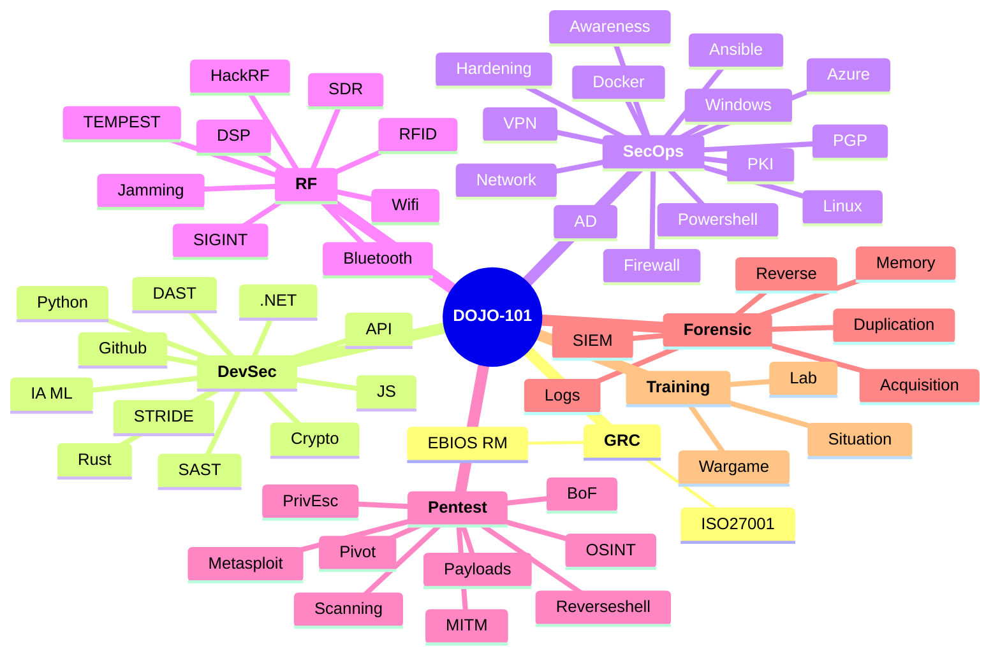

<p align="center">
    
</p>

[](https://www.gnu.org/licenses/gpl-3.0)
[](https://github.com/Aif4thah/Dojo-101/pulls)

[](https://github.com/sponsors/Aif4thah/)

Dojo-101 is a project for capturing experience and knowledge in cybersecurity.

Usable offline with a simple text editor, its purpose is to freely share knowledge.

>⚠️ This repository and its tools are provided "as is." The author(s) make no representations or warranties, express or implied, regarding the operation of the information, content, materials, tools, services, or products included. The author(s) disclaim, to the full extent permissible by law, all warranties, express or implied, including implied warranties of merchantability and fitness for a particular purpose.


## ⚔️ Themes

* [Secure development](https://github.com/Aif4thah/Dojo-101/tree/main/Dojo-101-DevSec)
* [Secure administration](https://github.com/Aif4thah/Dojo-101/tree/main/Dojo-101-SecOps)
* [Pentest](https://github.com/Aif4thah/Dojo-101/tree/main/Dojo-101-Pentest)
* [Forensic](https://github.com/Aif4thah/Dojo-101/tree/main/Dojo-101-Forensic)
* [Radio frequencies](https://github.com/Aif4thah/Dojo-101/tree/main/Dojo-101-RF)
* [Governance, Risk, and Compliance](https://github.com/Aif4thah/Dojo-101/tree/main/Dojo-101-Governance)




## 👉 Let’s get started!

README Files and those containing the keyword `basics` contain elements that are subsequently considered prerequisites. Here are some suggestions:

* [Cyber basics (french)](https://github.com/Aif4thah/Dojo-101/blob/main/Dojo-101-SecOps/README.md)
* [Linux basics](https://github.com/Aif4thah/Dojo-101/blob/main/Dojo-101-SecOps/Linux-Basics.md)
* [Powershell basics](https://github.com/Aif4thah/Dojo-101/blob/main/Dojo-101-SecOps/Powershell-basics.md)
* [Python basics](https://github.com/Aif4thah/Dojo-101/blob/main/Dojo-101-DevSec/Python-basics.md)
* [Radio frequency basics](https://github.com/Aif4thah/Dojo-101/blob/main/Dojo-101-RF/README.md)
* [GitHub basics](https://github.com/Aif4thah/Dojo-101/blob/main/Dojo-101-DevSec/Github-basics.md)
* [AI Basics](https://github.com/Aif4thah/Dojo-101/blob/main/Dojo-101-DevSec/IA-ML-basics.md)


## 📒 You need almost nothing.

Clone the repository without the history using the following command:

```sh
git clone --depth 1 https://github.com/Aif4thah/Dojo-101
```

Open `DOJO-101` folder with [VSCode](https://code.visualstudio.com/) then,

* Search by keyword across all files (e.g., `basics`, `Windows`, `Linux`)
* Read the content in `HTML` format (`ctrl`+`shift` +`V`)

## 🤝 Contributions

* [Contributor guidelines](https://github.com/Aif4thah/Dojo-101/blob/main/CONTRIBUTING.md)

## 🚨 Security

* [About project security](https://github.com/Aif4thah/Dojo-101/blob/main/SECURITY.md)

## 🌱 Learning

* [Professional scenarios](https://github.com/Aif4thah/Dojo-101/tree/main/Dojo-101-Apprentissage)

## 🧪 Test your skills

Developed in parallel, this application contains numerous vulnerabilities for testing your knowledge :

* [VulnerableLightApp](https://github.com/Aif4thah/VulnerableLightApp)

## 🏆 Credits

* Project maintained by [Michael Vacarella](https://github.com/Aif4thah)
* Logo created by [@designbyzen](https://www.designbyzen.fr/)
* **Thank you** to all contributors 😍
