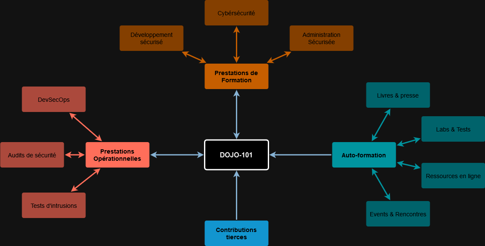

    

Dojo-101 is a project for capturing experience and knowledge in cybersecurity.

Usable offline with a simple text editor, its purpose is to freely share knowledge.

### Language :

> ⚠️ [Before using, please read the project’s disclaimer](./CODE_OF_CONDUCT.md)

## 💡 Principle

## 👉 Let’s get started!

Files containing the word “basics” contain elements that are subsequently considered prerequisites. Here are some suggestions:

* [Cyber basics](https://github.com/Aif4thah/Dojo-101/blob/main/Basics-fondamentaux.md)
* [Linux basics](https://github.com/Aif4thah/Dojo-101/blob/main/Dojo-101-SecOps/Linux-Basics.md)
* [Powershell basics](https://github.com/Aif4thah/Dojo-101/blob/main/Dojo-101-SecOps/Powershell-basics.md)
* [Python basics](https://github.com/Aif4thah/Dojo-101/blob/main/Dojo-101-DevSec/Python-basics.md)
* [Radio basics](https://github.com/Aif4thah/Dojo-101/blob/main/Dojo-101-RF/RF-basics.md)
* [GitHub basics](https://github.com/Aif4thah/Dojo-101/blob/main/Dojo-101-DevSec/Github-basics.md)
* [AI Basics](https://github.com/Aif4thah/Dojo-101/blob/main/Dojo-101-DevSec/IA-ML-basics.md)

## ⚔️ Themes

* [Secure development](https://github.com/Aif4thah/Dojo-101/tree/main/Dojo-101-DevSec)
* [Secure administration](https://github.com/Aif4thah/Dojo-101/tree/main/Dojo-101-SecOps)
* [Pentest](https://github.com/Aif4thah/Dojo-101/tree/main/Dojo-101-Pentest)
* [Forensic](https://github.com/Aif4thah/Dojo-101/tree/main/Dojo-101-Forensic)
* [Radio frequencies](https://github.com/Aif4thah/Dojo-101/tree/main/Dojo-101-RF)

## ⬇️ Installation

0.  If you are using Windows (client) and do not have Git installed : `winget install git.git `
1. `git clone https://github.com/Aif4thah/Dojo-101.git` 
2. The content is regularly updated, so remember to do a `git pull` before using it.

## 📖 Usage

This project is designed to not depend on **any third-party software**; your text/code editor is the only tool you need to searching, reading or modifying.

As an example, you can open `DOJO-101` directory with [VSCodium](https://github.com/VSCodium/vscodium) to :

* Search by keyword across all files (e.g., `basics`, `Windows`, `Linux`)
* Read the content in `HTML` format (`ctrl`+`shift` +`V`)

    

## 🤝 Contributions

* [Contributor guidelines](./CONTRIBUTING)

## 🚨 Security

* [About project security](./SECURITY.md)

## 🌱 Learning

* [Professional scenarios](https://github.com/Aif4thah/Dojo-101/tree/main/Dojo-101-Apprentissage)

## 🧪 Test your skills

Developed in parallel, this application contains numerous vulnerabilities for testing your knowledge :

* [VulnerableLightApp](https://github.com/Aif4thah/VulnerableLightApp)

## 🏆 Credits

* Project maintained by [Michael Vacarella](https://github.com/Aif4thah)
* Logo created by [@designbyzen](https://www.designbyzen.fr/)
* **Thank you** to all contributors 😍
